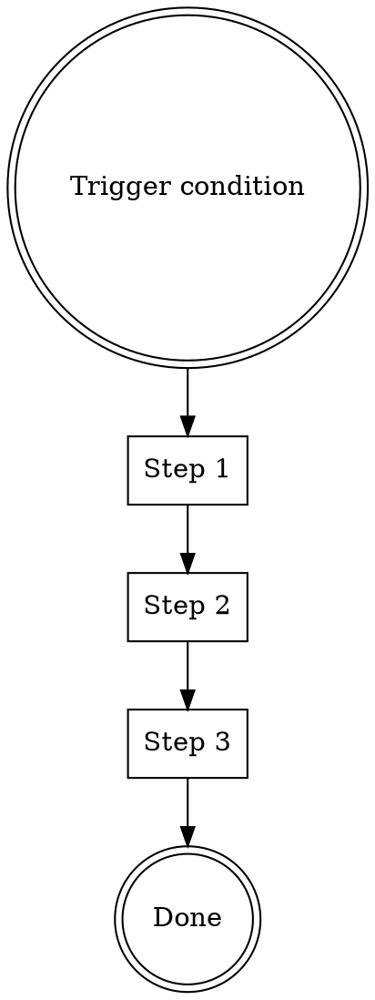

# Skill Infrastructure (D1-D3) Implementation Plan

> **For agentic workers:** REQUIRED SUB-SKILL: Use summ:subagent-driven-development (recommended) or summ:executing-plans to implement this plan task-by-task. Steps use checkbox (`- [ ]`) syntax for tracking.

**Goal:** Create automated tooling for skill format validation (lint-skills.sh) and a standardized skill template, enabling CI-integrated quality checks for all skills in the repository.

**Architecture:** A single `scripts/lint-skills.sh` bash script combines D1 (format validation) and D2 (quality checks). A `scripts/skill-template.md` provides the D3 template. Both are runnable locally and CI-ready. No external dependencies beyond bash + standard unix tools. Note: bucket consistency checks from the original D1 spec are N/A — this repo has no bucket structure (no engineering/productivity/misc directories), and plugin.json has no skills list.

**Tech Stack:** Bash 4+, grep, sed, awk, find. No npm/pip dependencies.

---

## File Structure

| File | Responsibility |
|------|---------------|
| `scripts/lint-skills.sh` | All validation logic: frontmatter, naming, links, quality checks |
| `scripts/skill-template.md` | Standardized SKILL.md template with section guidelines |
| `scripts/README.md` | Usage docs for the scripts |

---

### Task 1: Create scripts/ directory and README

**Files:**
- Create: `scripts/README.md`

- [ ] **Step 1: Create scripts directory**

Run: `mkdir -p scripts`

- [ ] **Step 2: Create README.md**

```markdown
# Scripts

Development tooling for the SUMM-Powers skill library.

## lint-skills.sh

Validates all skills against format and quality rules.

```bash
# Check all skills
./scripts/lint-skills.sh

# Check a specific skill
./scripts/lint-skills.sh skills/test-driven-development

# Quiet mode (only errors)
./scripts/lint-skills.sh -q

# Verbose mode (show passing checks)
./scripts/lint-skills.sh -v
```

## skill-template.md

Template for creating new skills. Copy and fill in:

```bash
cp scripts/skill-template.md skills/my-new-skill/SKILL.md
```
```

- [ ] **Step 3: Commit**

```bash
git add scripts/README.md
git commit -m "chore: add scripts directory with usage docs"
```

---

### Task 2: Create lint-skills.sh — frontmatter validation (D1 core)

**Files:**
- Create: `scripts/lint-skills.sh`

- [ ] **Step 1: Write the script with frontmatter validation logic**

```bash
#!/usr/bin/env bash
# lint-skills.sh — Validate SKILL.md files against format and quality rules.
# Usage: ./scripts/lint-skills.sh [options] [skill-path ...]
#   No args  = check all skills under skills/
#   skill-path = check one or more specific skill directories

set -euo pipefail

# ── Options ──────────────────────────────────────────────────────────
VERBOSE=0
QUIET=0
ERRORS=0
WARNINGS=0

for arg in "$@"; do
  case "$arg" in
    -v|--verbose) VERBOSE=1; shift ;;
    -q|--quiet)   QUIET=1; shift ;;
  esac
done

# ── Helpers ──────────────────────────────────────────────────────────
error() {
  ((QUIET)) && return
  local loc="$1"; shift
  echo "  ERROR [$loc]: $*" >&2
  ((ERRORS++))
}

warn() {
  ((QUIET)) && return
  local loc="$1"; shift
  echo "  WARN  [$loc]: $*" >&2
  ((WARNINGS++))
}

info() {
  ((VERBOSE)) || return
  local loc="$1"; shift
  echo "  ok    [$loc]: $*" >&2
}

# ── Discover skills ──────────────────────────────────────────────────
SCRIPT_DIR="$(cd "$(dirname "$0")" && pwd)"
REPO_ROOT="$(cd "$SCRIPT_DIR/.." && pwd)"
SKILLS_DIR="$REPO_ROOT/skills"

TARGETS=()
for arg in "$@"; do
  [[ "$arg" == -v || "$arg" == -q || "$arg" == --verbose || "$arg" == --quiet ]] && continue
  TARGETS+=("$arg")
done

if ((${#TARGETS[@]} == 0)); then
  while IFS= read -r -d '' d; do
    [[ -f "$d/SKILL.md" ]] && TARGETS+=("$d")
  done < <(find "$SKILLS_DIR" -mindepth 1 -maxdepth 1 -type d -not -name 'ext-*' -print0 | sort -z)
fi

echo "Linting ${#TARGETS[@]} skill(s)..."

# ── Per-skill checks ────────────────────────────────────────────────
check_skill() {
  local skill_dir="$1"
  local skill_name
  skill_name="$(basename "$skill_dir")"
  local skill_file="$skill_dir/SKILL.md"

  echo "Checking: $skill_name"

  # 1. SKILL.md exists
  if [[ ! -f "$skill_file" ]]; then
    error "$skill_name" "SKILL.md not found"
    return
  fi
  info "$skill_name" "SKILL.md exists"

  # 2. Parse frontmatter
  local fm
  fm=$(sed -n '/^---$/,/^---$/p' "$skill_file" | head -n -1 | tail -n +2)

  if [[ -z "$fm" ]]; then
    error "$skill_name" "No YAML frontmatter found"
    return
  fi

  # 3. Required fields: name, description
  local name desc
  name=$(echo "$fm" | grep -oP '^name:\s*\K.*' || true)
  desc=$(echo "$fm" | grep -oP '^description:\s*\K.*' || true)

  if [[ -z "$name" ]]; then
    error "$skill_name" "Missing required field: name"
  else
    info "$skill_name" "name = $name"
  fi

  if [[ -z "$desc" ]]; then
    error "$skill_name" "Missing required field: description"
  fi

  # 4. Directory name == name field
  if [[ -n "$name" && "$name" != "$skill_name" ]]; then
    error "$skill_name" "Directory name '$skill_name' != frontmatter name '$name'"
  else
    info "$skill_name" "Directory name matches frontmatter name"
  fi

  # 5. Name format: lowercase, digits, hyphens only
  if [[ -n "$name" && ! "$name" =~ ^[a-z0-9][a-z0-9-]*$ ]]; then
    error "$skill_name" "Name '$name' must be lowercase alphanumeric with hyphens"
  fi

  # 6. Description length ≤ 1024 chars
  if [[ -n "$desc" && ${#desc} -gt 1024 ]]; then
    error "$skill_name" "Description is ${#desc} chars (max 1024)"
  fi

  # 7. Description starts with "Use when" (recommended)
  if [[ -n "$desc" && ! "$desc" =~ ^Use\ when ]]; then
    warn "$skill_name" "Description should start with 'Use when ...'"
  else
    info "$skill_name" "Description starts with 'Use when'"
  fi
}

for t in "${TARGETS[@]}"; do
  check_skill "$t"
done

# ── Summary ──────────────────────────────────────────────────────────
echo ""
echo "Done. $ERRORS error(s), $WARNINGS warning(s)."
if ((ERRORS > 0)); then
  exit 1
fi
exit 0
```

- [ ] **Step 2: Make executable**

Run: `chmod +x scripts/lint-skills.sh`

- [ ] **Step 3: Run against all skills to verify**

Run: `./scripts/lint-skills.sh -v`
Expected: All 20 skills pass with no errors. Some warnings for descriptions not starting with "Use when".

- [ ] **Step 4: Commit**

```bash
git add scripts/lint-skills.sh
git commit -m "feat: add lint-skills.sh with frontmatter validation (D1)"
```

---

### Task 3: Add link validation to lint-skills.sh (D2 core)

**Files:**
- Modify: `scripts/lint-skills.sh`

- [ ] **Step 1: Add link-checking function inside the `check_skill()` function, after the frontmatter checks**

Insert after the description format check (the "Description starts with 'Use when'" block), before the closing `}` of `check_skill`:

```bash
  # ── Link validation ───────────────────────────────────────────────
  # Extract markdown links: [text](path) where path is a relative file reference
  local body
  body=$(sed '1,/^---$/d' "$skill_file" | sed '1,/^---$/d')

  while IFS= read -r link; do
    [[ -z "$link" ]] && continue
    # Resolve relative paths from the skill directory
    # Handle ../  prefixes (cross-skill references)
    local target="$skill_dir/$link"
    # Normalize the path
    target=$(cd "$(dirname "$target")" 2>/dev/null && pwd)/$(basename "$target") 2>/dev/null || true

    if [[ ! -e "$target" ]]; then
      # Check if it's a URL (skip)
      if [[ ! "$link" =~ ^https?:// && ! "$link" =~ ^mailto: ]]; then
        warn "$skill_name" "Broken link: $link"
      fi
    fi
  done < <(echo "$body" | grep -oP '\[(?:[^\]]*)\]\(\K[^)#)]+' | grep -v '^https\?://' | grep -v '^mailto:')
```

- [ ] **Step 2: Run and verify**

Run: `./scripts/lint-skills.sh`
Expected: Should detect broken links in `writing-skills/anthropic-best-practices.md` (the references to FORMS.md, REFERENCE.md, etc. that don't exist in that directory — but note these are in the anthropic-best-practices.md file, not SKILL.md itself). The script only checks SKILL.md links, so these should not be flagged unless SKILL.md directly links to them.

- [ ] **Step 3: Run with verbose to see all checks**

Run: `./scripts/lint-skills.sh -v 2>&1 | head -80`
Expected: See per-skill output with ok/warn/error status for each check.

- [ ] **Step 4: Commit**

```bash
git add scripts/lint-skills.sh
git commit -m "feat: add link validation to lint-skills.sh (D2)"
```

---

### Task 4: Add quality checks to lint-skills.sh (D2 extended)

**Files:**
- Modify: `scripts/lint-skills.sh`

- [ ] **Step 1: Add quality check functions after the link validation block, still inside `check_skill()`**

```bash
  # ── Quality checks ────────────────────────────────────────────────
  local total_lines
  total_lines=$(wc -l < "$skill_file")

  # 1. SKILL.md should have a top-level heading (# Title)
  if ! grep -qP '^# ' "$skill_file"; then
    error "$skill_name" "No top-level heading (# Title) found"
  else
    info "$skill_name" "Has top-level heading"
  fi

  # 2. Warn if SKILL.md exceeds 300 lines (progressive disclosure threshold)
  if ((total_lines > 300)); then
    warn "$skill_name" "SKILL.md is $total_lines lines (consider splitting into reference files)"
  fi

  # 3. Warn if no "Use when" or trigger guidance anywhere in the file
  if ! grep -qi "use when\|trigger\|when to use" "$skill_file"; then
    warn "$skill_name" "No usage trigger guidance found"
  fi

  # 4. Check for common placeholder patterns
  local placeholders
  placeholders=$(grep -ciP 'TBD|TODO|FIXME|PLACEHOLDER|\[insert|<fill' "$skill_file" || true)
  if ((placeholders > 0)); then
    error "$skill_name" "Contains $placeholders placeholder(s): TBD/TODO/FIXME/PLACEHOLDER"
  fi

  # 5. Referenced local files should exist
  # Already covered by link validation above
```

- [ ] **Step 2: Run full check**

Run: `./scripts/lint-skills.sh -v 2>&1`
Expected: All 20 skills checked with frontmatter + link + quality checks. Some warnings expected (e.g., `writing-skills` is >300 lines, `systematic-debugging` is >300 lines).

- [ ] **Step 3: Commit**

```bash
git add scripts/lint-skills.sh
git commit -m "feat: add quality checks to lint-skills.sh (D2 extended)"
```

---

### Task 5: Create skill-template.md (D3)

**Files:**
- Create: `scripts/skill-template.md`

- [ ] **Step 1: Write the template**

```markdown
---
name: {{skill-name}}
description: Use when [specific trigger conditions]. Skip when [exclusion conditions].
---

# {{Skill Title}}

## When to Use

[2-3 sentences describing the specific situations where this skill should be activated.]

## When NOT to Use

[1-2 sentences describing situations where this skill does not apply.]

## Process



### Step 1: [Name]

[What to do, with specific instructions.]

### Step 2: [Name]

[What to do, with specific instructions.]

### Step 3: [Name]

[What to do, with specific instructions.]

## Common Scenarios

### Scenario A: [Typical use case]

[Specific example with concrete steps.]

### Scenario B: [Another use case]

[Specific example with concrete steps.]

## Anti-Patterns

| Thought | Reality |
|---------|---------|
| "[common rationalization]" | "[why it's wrong]" |
| "[common shortcut]" | "[what goes wrong]" |

## Key Principles

- **[Principle 1]**: [One sentence explanation]
- **[Principle 2]**: [One sentence explanation]
```

- [ ] **Step 2: Validate template passes lint**

The template uses `{{placeholder}}` markers. Before linting, substitute them:
Run: `mkdir -p /tmp/test-skill && sed 's/{{skill-name}}/test-skill/g; s/{{Skill Title}}/Test Skill/g' scripts/skill-template.md > /tmp/test-skill/SKILL.md && ./scripts/lint-skills.sh /tmp/test-skill; echo "Exit: $?"`
Expected: Passes with no errors (may have warnings about trigger guidance wording).

- [ ] **Step 3: Clean up test artifact**

Run: `rm -rf /tmp/test-skill`

- [ ] **Step 4: Commit**

```bash
git add scripts/skill-template.md
git commit -m "feat: add skill-template.md with standardized sections (D3)"
```

---

### Task 6: Final integration test

**Files:**
- No new files

- [ ] **Step 1: Run lint against all skills**

Run: `./scripts/lint-skills.sh -v`
Expected: Reports all 20 skills. Errors = 0 (or list known issues to fix). Warnings are acceptable.

- [ ] **Step 2: Test single-skill mode**

Run: `./scripts/lint-skills.sh skills/brainstorming`
Expected: Checks only brainstorming skill, passes.

- [ ] **Step 3: Test quiet mode**

Run: `./scripts/lint-skills.sh -q; echo "Exit: $?"`
Expected: No output on success, exit code 0.

- [ ] **Step 4: Verify non-existent skill fails**

Run: `./scripts/lint-skills.sh skills/nonexistent 2>&1; echo "Exit: $?"`
Expected: Error message about missing SKILL.md, exit code 1.

- [ ] **Step 5: Verify scripts/README.md is accurate**

Run: `cat scripts/README.md`
Expected: Documentation matches actual script behavior.

- [ ] **Step 6: Final commit (if any fixes needed)**

```bash
git add -A scripts/
git commit -m "chore: finalize skill infrastructure tooling"
```
