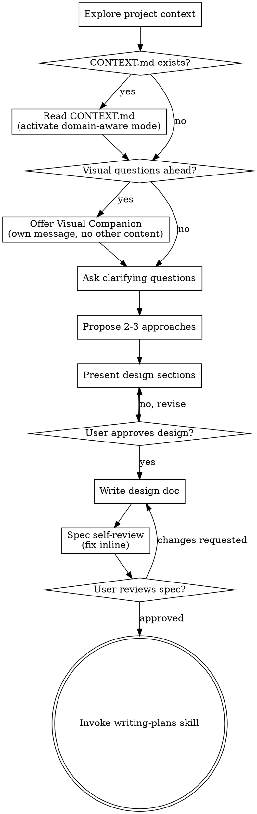

# v2.1 Domain-Awareness Integration Implementation Plan

> **For agentic workers:** REQUIRED SUB-SKILL: Use summ:subagent-driven-development (recommended) or summ:executing-plans to implement this plan task-by-task. Steps use checkbox (`- [ ]`) syntax for tracking.

**Goal:** Enhance `writing-skills` (B3) with 100-line principle, progressive disclosure, description precision, and script judgment guide. Enhance `brainstorming` (B4) with domain language integration from v2.0's CONTEXT.md system.

**Architecture:** Both B3 and B4 are edits to existing SKILL.md files. B3 adds 3 enhancement blocks to writing-skills. B4 adds a domain language gate to the checklist + domain-aware behaviors to the process. They are independent — can execute in parallel or any order.

**Tech Stack:** Markdown skill files, `scripts/lint-skills.sh` for validation.

**Dependency:** B4 references the CONTEXT.md mechanism from v2.0's A1 (domain-language skill, already complete). B3 has no external dependencies.

---

## File Structure

| File | Action | Responsibility |
|------|--------|---------------|
| `skills/writing-skills/SKILL.md` | Modify | Add progressive disclosure (after Directory Structure), enhance CSO (description precision), add script judgment guide (new section) |
| `skills/brainstorming/SKILL.md` | Modify | Add domain language gate (checklist item 2), update process flow, add domain-aware mode to process |
| `VERSION.md` | Modify | Mark v2.1 complete, bump version |
| `.claude-plugin/plugin.json` | Modify | Bump version to `5.0.7-summ.2.1` |

---

## Scope Check

B3 and B4 are independent enhancements to two different skills. This single plan covers both since they share the same version (v2.1) and are of similar scope (documentation edits). Each task modifies one skill.

---

## Part 1: writing-skills Enhancements (B3)

### Task 1: Add progressive disclosure pattern to writing-skills

**Files:**
- Modify: `skills/writing-skills/SKILL.md:84-91` (Directory Structure section)

**Context:** The Directory Structure section tells authors when to use separate files, but doesn't prescribe a reading-layer pattern. The progressive disclosure pattern from mattpocock's `write-a-skill` gives authors a concrete structure: overview → when to use → workflow → advanced (linked).

- [ ] **Step 1: Add progressive disclosure pattern after the "Keep inline" list**

Insert after line 91 (`- Everything else`) and before line 93 (`## SKILL.md Structure`):

```markdown

### Progressive Disclosure

Structure SKILL.md for layered reading:

1. **Overview** (5-10 lines) — Core principle, what this skill does
2. **When to Use** (10-15 lines) — Triggers, symptoms, "Skip when" exclusions
3. **Core Workflow** (30-50 lines) — Main process, flowchart, quick reference
4. **Advanced/Reference** → link to separate files

**100-line target:** SKILL.md should stay ≤100 lines. When it grows beyond that, detailed content belongs in reference files that agents load on demand.

Some skills cover broad topics (like this one, at 600+ lines) and naturally exceed the target. That's acceptable for comprehensive reference skills — but most skills should aim for the target. When in doubt, extract.
```

- [ ] **Step 2: Verify with lint**

Run: `./scripts/lint-skills.sh skills/writing-skills`
Expected: 0 errors (warnings about line count expected).

- [ ] **Step 3: Commit**

```bash
git add skills/writing-skills/SKILL.md
git commit -m "feat(B3): add progressive disclosure and 100-line principle to writing-skills"
```

---

### Task 2: Enhance CSO description guidance in writing-skills

**Files:**
- Modify: `skills/writing-skills/SKILL.md:95-198` (Frontmatter + CSO sections)

**Context:** The CSO section already has excellent guidance but lacks two patterns: (1) explicit "Skip when" for negative triggers, (2) explicit 1024-char limit callout. These help agents write better descriptions and avoid the "description summarizes workflow" trap.

- [ ] **Step 1: Add 1024-char limit callout to Frontmatter section**

After line 97 (`- Max 1024 characters total`), replace the bullet:

```markdown
- **Max 1024 characters total** for the entire frontmatter block. Keep description under 500 characters to leave room for `name` field and YAML formatting. Count with: `sed -n '2,/^---$/p' skills/name/SKILL.md | wc -c`
```

- [ ] **Step 2: Add "Skip when" pattern to CSO Rich Description section**

After line 198 (the last `# ✅ GOOD` example in the description examples block), add:

```markdown

# ✅ GOOD: Include negative triggers ("Skip when") for better disambiguation
description: Use when creating new skills, editing existing skills, or verifying skills work before deployment. Skip for one-off scripts or project-specific CLAUDE.md entries.
```

And add a note after the "Content:" bullet list (after line 180, `Write in third person (injected into system prompt)`):

```markdown
- **Include "Skip when" when the skill could be confused with similar skills.** Negative triggers ("Skip for...", "Not for...") help agents distinguish between overlapping skills.
```

- [ ] **Step 3: Verify with lint**

Run: `./scripts/lint-skills.sh skills/writing-skills`
Expected: 0 errors.

- [ ] **Step 4: Commit**

```bash
git add skills/writing-skills/SKILL.md
git commit -m "feat(B3): enhance CSO description with Skip when pattern and char limit callout"
```

---

### Task 3: Add script judgment guide to writing-skills

**Files:**
- Modify: `skills/writing-skills/SKILL.md:581` (after Anti-Patterns section, before STOP section)

**Context:** From mattpocock's `write-a-skill`: when to convert documentation into scripts. Deterministic operations → script. Repeated code generation → script. Judgment calls → documentation.

- [ ] **Step 1: Add script judgment section**

Insert after line 581 (`**Why bad:** Labels should have semantic meaning`) and before line 583 (`## STOP: Before Moving to Next Skill`):

```markdown

## Script vs Documentation Decision Guide

When creating or editing a skill, decide: should this be a **script** (automated, deterministic) or **documentation** (guidance, judgment)?

**Add a script when:**
- The operation is **deterministic** — same input, same output every time
- You generate **identical code** across multiple sessions
- The check can be a **pass/fail test** (lint, format, validate)
- The tool doesn't exist and would save **repeated manual work**

**Keep as documentation when:**
- The decision requires **context or judgment** (which approach? how far to refactor?)
- The output varies based on **project-specific conventions**
- The guidance is about **when/why**, not **what/how**
- Agents need to **adapt** the pattern to the specific situation

**Pattern:** `deterministic + repeatable → script it` | `judgment-dependent → document it` | `both → script the mechanical part, document the judgment call`

**Example:**
- Script: `scripts/lint-skills.sh` — deterministically validates frontmatter format, checks line counts, finds broken links
- Documentation: "When to create a skill" section — requires judgment about reusability and scope
- Both: lint script handles format; documentation explains when/why the format matters
```

- [ ] **Step 2: Verify with lint**

Run: `./scripts/lint-skills.sh skills/writing-skills`
Expected: 0 errors.

- [ ] **Step 3: Commit**

```bash
git add skills/writing-skills/SKILL.md
git commit -m "feat(B3): add script vs documentation judgment guide to writing-skills"
```

---

## Part 2: brainstorming Enhancement (B4)

### Task 4: Add domain language gate to brainstorming

**Files:**
- Modify: `skills/brainstorming/SKILL.md:23-32` (Checklist)
- Modify: `skills/brainstorming/SKILL.md:36-65` (Process Flow diagram)

**Context:** When a project has `CONTEXT.md` (created by v2.0's domain-language skill), brainstorming should read it and activate domain-aware mode. This is a conditional gate — only triggers when CONTEXT.md exists.

- [ ] **Step 1: Insert domain language check as checklist item 2**

Replace lines 24-32 (the current checklist) with:

```markdown

1. **Explore project context** — check files, docs, recent commits
2. **Domain language check** — if `CONTEXT.md` exists at project root, read it and activate domain-aware mode (see Domain-Aware Mode below)
3. **Offer visual companion** (if topic will involve visual questions) — this is its own message, not combined with a clarifying question. See the Visual Companion section below.
4. **Ask clarifying questions** — one at a time, understand purpose/constraints/success criteria
5. **Propose 2-3 approaches** — with trade-offs and your recommendation
6. **Present design** — in sections scaled to their complexity, get user approval after each section
7. **Write design doc** — save to `docs/superpowers/specs/YYYY-MM-DD-<topic>-design.md` and commit
8. **Spec self-review** — quick inline check for placeholders, contradictions, ambiguity, scope (see below)
9. **User reviews written spec** — ask user to review the spec file before proceeding
10. **Transition to implementation** — invoke writing-plans skill to create implementation plan
```

- [ ] **Step 2: Update process flow diagram**

Replace lines 36-65 (the dot diagram) with:



- [ ] **Step 3: Verify with lint**

Run: `./scripts/lint-skills.sh skills/brainstorming`
Expected: 0 errors.

- [ ] **Step 4: Commit**

```bash
git add skills/brainstorming/SKILL.md
git commit -m "feat(B4): add domain language gate to brainstorming checklist and flow"
```

---

### Task 5: Add domain-aware process behaviors to brainstorming

**Files:**
- Modify: `skills/brainstorming/SKILL.md:68-106` (The Process section)

**Context:** The actual domain-aware behaviors: inline CONTEXT.md updates, challenge existing language, sharpen vague language, scenario stress testing, code cross-validation. These integrate into existing process phases.

- [ ] **Step 1: Add domain-aware mode section after "Understanding the idea"**

Insert after line 78 (`- Focus on understanding: purpose, constraints, success criteria`) and before line 80 (`**Exploring approaches:**`):

```markdown

**Domain-aware mode (when CONTEXT.md exists):**

When the project has a CONTEXT.md, activate these behaviors throughout the session:

- **Inline updates:** When a term is clarified or confirmed, update CONTEXT.md immediately — don't batch updates for later
- **Challenge conflicts:** If the user uses a term differently from CONTEXT.md's definition, point it out: "CONTEXT.md defines [term] as [X], but you're using it as [Y]. Should we update the definition?"
- **Sharpen vagueness:** When the user uses a vague term that isn't in CONTEXT.md, propose a precise definition and ask whether to add it
```

- [ ] **Step 2: Add scenario stress testing to "Exploring approaches"**

After line 84 (`- Lead with your recommended option and explain why`), add:

```markdown
- Invent concrete edge scenarios that test concept boundaries — "What happens when [edge case]? Does [term] from CONTEXT.md still apply here?"
```

- [ ] **Step 3: Add code cross-validation to "Working in existing codebases"**

After line 105 (`- Don't propose unrelated refactoring. Stay focused on what serves the current goal.`), add:

```markdown
- When the user says "this works like X" or "this module does Y", check the actual code to confirm. If there's a mismatch between the user's mental model and the code, flag it — this often reveals misunderstandings worth exploring
```

- [ ] **Step 4: Verify with lint**

Run: `./scripts/lint-skills.sh skills/brainstorming`
Expected: 0 errors.

- [ ] **Step 5: Commit**

```bash
git add skills/brainstorming/SKILL.md
git commit -m "feat(B4): add domain-aware behaviors to brainstorming process"
```

---

## Part 3: Finalization

### Task 6: Update VERSION.md and finalize

**Files:**
- Modify: `VERSION.md`
- Modify: `.claude-plugin/plugin.json`

- [ ] **Step 1: Run full lint suite**

Run: `./scripts/lint-skills.sh`
Expected: 0 errors across all skills.

- [ ] **Step 2: Update VERSION.md**

In the header, change:
```
> 当前版本: `5.0.7-summ.2.0`
```
to:
```
> 当前版本: `5.0.7-summ.2.1`
```

Change the v2.1 section status to 已完成:

```markdown
## v2.1 — Domain-Awareness Integration (已完成)

> 计划文档: [v2.1 Implementation Plan](docs/superpowers/plans/2026-04-29-v2.1-domain-awareness-integration.md)

将 domain-awareness 模式整合到现有技能编写和头脑风暴流程中。

| 编号 | 内容 | 来源 | 状态 |
|------|------|------|------|
| B3 | `writing-skills` 增强 — 100 行上限原则、progressive disclosure、description field 精确写法、脚本添加判断 | `write-a-skill` | 已完成 |
| B4 | `brainstorming` 增强 — 内联文档更新、挑战现有语言、模糊语言锐化、具体场景压力测试、代码交叉验证 | `grill-with-docs` | 已完成 |

**依赖**: v2.0 的 A1 Domain Language 系统
```

- [ ] **Step 3: Update plugin version**

In `.claude-plugin/plugin.json`, change version to `5.0.7-summ.2.1`.

- [ ] **Step 4: Commit**

```bash
git add VERSION.md .claude-plugin/plugin.json
git commit -m "chore: mark v2.1 complete, bump version to 5.0.7-summ.2.1"
```

---

## Self-Review

### 1. Spec Coverage (from VERSION.md v2.1)

| Spec Requirement | Task |
|-----------------|------|
| B3: 100 行上限原则 | Task 1 (progressive disclosure section) |
| B3: progressive disclosure | Task 1 (layered reading pattern) |
| B3: description field 精确写法 | Task 2 (Skip when pattern, 1024 char callout) |
| B3: 脚本添加判断 | Task 3 (script vs documentation guide) |
| B4: 内联文档更新 | Task 5 (domain-aware mode: inline updates) |
| B4: 挑战现有语言 | Task 5 (domain-aware mode: challenge conflicts) |
| B4: 模糊语言锐化 | Task 5 (domain-aware mode: sharpen vagueness) |
| B4: 具体场景压力测试 | Task 5 (scenario stress testing in Exploring approaches) |
| B4: 代码交叉验证 | Task 5 (code cross-validation in Working in existing codebases) |

All spec items covered.

### 2. Placeholder Scan

No TBD, TODO, FIXME, PLACEHOLDER, "implement later", "fill in details" found. All content blocks contain complete text.

### 3. Consistency Check

- Checklist items in Task 4 renumber 1-10 (was 1-9 with new item 2 inserted). Process flow diagram updated to match. ✓
- Domain-aware mode added to "Understanding the idea" section (after step 1 of checklist), which is the correct position — after context exploration, before detailed questioning. ✓
- Script judgment guide references `lint-skills.sh` which exists at `scripts/lint-skills.sh`. ✓
- CONTEXT.md references the domain-language skill created in v2.0. ✓

### 4. Line Count Estimates

| File | Before | After (est.) | Notes |
|------|--------|-------------|-------|
| `writing-skills/SKILL.md` | 655 | ~710 | +55 lines across 3 enhancements |
| `brainstorming/SKILL.md` | 169 | ~200 | +31 lines (checklist + flow + domain-aware) |

Both files grow moderately. brainstorming stays close to its current structure. writing-skills is already a comprehensive reference skill and the additions are proportional.
