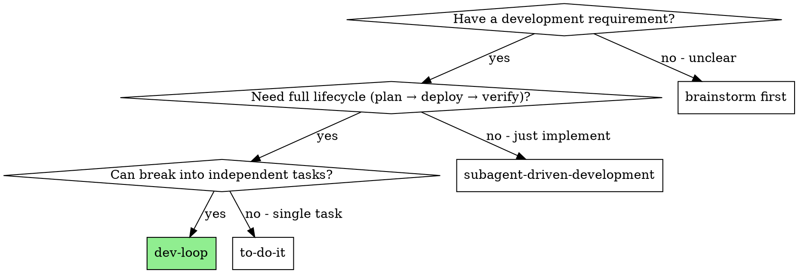

# dev-loop Skill Implementation Plan

> **For agentic workers:** REQUIRED SUB-SKILL: Use summ:subagent-driven-development (recommended) or summ:executing-plans to implement this plan task-by-task. Steps use checkbox (`- [ ]`) syntax for tracking.

**Goal:** Create a `dev-loop` skill that automates the full development lifecycle (planning → TDD → review → deploy → E2E → value proof) with loop-back on failure, integrating SUMM-Powers skills with Agent-Orchestrator spawn.

**Architecture:** A single skill (`dev-loop`) with three supporting files (master prompt, worker prompt template, example config). The skill defines a state machine with 4 phases and 9 sub-states. Master agent runs in an AO orchestrator session and dispatches worker agents via `ao spawn` for execution tasks.

**Tech Stack:** Markdown skill files, Agent-Orchestrator CLI (`ao spawn/status/send`), existing SUMM skills (brainstorming, writing-plans, TDD, deploy, code-review)

---

## File Structure

| File | Responsibility | Lines (est.) |
|------|----------------|--------------|
| `skills/dev-loop/SKILL.md` | Core skill: state machine, transitions, dispatch, review, value proof, loop-back, red flags | ~300 |
| `skills/dev-loop/master-prompt.md` | System prompt for master agent (role, tools, skill loading) | ~60 |
| `skills/dev-loop/worker-prompt-template.md` | Template for worker agent prompts (skill injection, report format) | ~80 |
| `docs/superpowers/examples/dev-loop-agent-orchestrator.yaml` | Example AO config with reactions and notifier | ~40 |

**Dependencies on existing skills:**
- `summ:brainstorming` — PLANNING.BRAINSTORMING
- `summ:writing-plans` — PLANNING.PLAN_WRITING
- `summ:test-driven-development` — BUILDING.TDD_IMPLEMENTING (worker)
- `summ:requesting-code-review` — BUILDING.CODE_REVIEWING
- `summ:deploy` — DELIVERING.DEPLOYING (worker)

---

## Task Index

| # | Task | Files | Complexity | Notes |
|---|------|-------|------------|-------|
| 1 | Pressure test scenarios | `skills/dev-loop/pressure-test-scenarios.md` | M | TDD: define tests first |
| 2 | SKILL.md core: frontmatter + overview + state machine | `skills/dev-loop/SKILL.md` | L | State machine is the heart |
| 3 | SKILL.md operations: dispatch + monitoring + review | `skills/dev-loop/SKILL.md` | M | Worker lifecycle management |
| 4 | SKILL.md completion: value proof + loop-back + escalation | `skills/dev-loop/SKILL.md` | M | Decision logic and recovery |
| 5 | Worker prompt template | `skills/dev-loop/worker-prompt-template.md` | S | Template with placeholders |
| 6 | Master agent prompt | `skills/dev-loop/master-prompt.md` | S | Role definition + tool access |
| 7 | Example AO configuration | `docs/superpowers/examples/dev-loop-agent-orchestrator.yaml` | S | Ready-to-use config snippet |
| 8 | Self-review and verification | `skills/dev-loop/pressure-test-scenarios.md`, `skills/dev-loop/SKILL.md` | S | Verify skill passes all pressure tests |

Complexity: S = ~50 lines of task content, M = ~150 lines, L = ~300+ lines
Batch budget: each batch targets ≤ 3M equivalent (1L = 2M = 3S)

---

### Batch 1 (Tasks 1-2)

### Task 1: Write Pressure Test Scenarios

**Files:**
- Create: `skills/dev-loop/pressure-test-scenarios.md`

These scenarios test the skill's ability to handle all state transitions and edge cases. Written first (TDD for skills).

- [ ] **Step 1: Create the pressure test file**

```markdown
---
name: dev-loop-pressure-tests
description: Pressure test scenarios for the dev-loop skill
type: reference
---

# dev-loop Pressure Test Scenarios

These scenarios verify the dev-loop skill handles all state transitions correctly. Each scenario describes a situation and the expected behavior.

## Scenario 1: Happy Path (Full Loop)

**Given:** A requirement "Add user registration API endpoint"
**Expected flow:**
1. Master agent loads `summ:brainstorming`, produces design
2. Master agent loads `summ:writing-plans`, produces plan with 3 tasks
3. Master dispatches 3 TDD workers via `ao spawn`
4. All 3 workers report DONE
5. Master runs code review on all PRs — all pass
6. Master dispatches deploy worker — deploy succeeds
7. Master dispatches E2E worker — tests pass
8. Master evaluates value proof — PASS
9. Master archives evidence and notifies human

**Verify:** State transitions: PLANNING → BUILDING → DELIVERING → VALIDATING → DONE. loopCount stays at 1.

## Scenario 2: Worker Returns BLOCKED

**Given:** A requirement with a task that depends on an external API
**Expected flow:**
1. Planning proceeds normally
2. Worker dispatched for the API-dependent task
3. Worker reports BLOCKED: "External API returns 403, need API key"
4. Master assesses: cannot resolve without human input
5. Master transitions to ESCALATED
6. Master notifies human with blocker details

**Verify:** State reaches ESCALATED, not DONE. Human receives actionable notification.

## Scenario 3: Code Review Finds Issues

**Given:** A requirement where TDD workers complete but code has quality issues
**Expected flow:**
1. Planning → dispatch workers → all report DONE
2. Code review finds: missing error handling, hardcoded values
3. Master transitions back to BUILDING.TDD_IMPLEMENTING
4. Master dispatches fix workers with specific review feedback
5. Fix workers report DONE
6. Code review passes on second attempt
7. Continue to DELIVERING

**Verify:** loopCount increments to 2. Re-dispatch targets only the problematic tasks.

## Scenario 4: Deploy Failure

**Given:** Workers complete and review passes, but deployment fails
**Expected flow:**
1. DELIVERING.DEPLOYING starts
2. Deploy worker reports failure: "Port already in use"
3. Master transitions back to BUILDING.TDD_IMPLEMENTING
4. Fix worker resolves the configuration issue
5. Re-review passes → re-deploy succeeds
6. Continue to E2E

**Verify:** Failure in DELIVERING routes back to BUILDING, not PLANNING.

## Scenario 5: E2E Test Failure

**Given:** Deployment succeeds but E2E tests fail
**Expected flow:**
1. DELIVERING.E2E_VERIFYING starts
2. E2E worker runs Playwright tests — 2 of 5 fail
3. Master transitions back to BUILDING.TDD_IMPLEMENTING
4. Fix workers address the failing test scenarios
5. Re-deploy → E2E passes on second attempt

**Verify:** E2E failure routes back to BUILDING.TDD_IMPLEMENTING, not DELIVERING.DEPLOYING.

## Scenario 6: Value Proof Fails — Requirement Misunderstood

**Given:** Implementation technically works but doesn't match the original requirement
**Expected flow:**
1. Full pipeline completes (TDD, review, deploy, E2E all pass)
2. Master evaluates value proof: "Requirement was 'user registration' but implementation is 'user invitation'"
3. Master identifies this as a requirement misunderstanding
4. Master transitions back to PLANNING.BRAINSTORMING
5. loopCount increments to 2
6. Re-planning with corrected understanding

**Verify:** Routes back to PLANNING (requirement gap), not BUILDING. loopCount = 2.

## Scenario 7: Value Proof Fails — Partial Implementation

**Given:** Some features are missing from the implementation
**Expected flow:**
1. Full pipeline completes
2. Value proof: "Requirement includes email verification but it's not implemented"
3. Master identifies as partial implementation
4. Master transitions back to BUILDING.TDD_IMPLEMENTING
5. Dispatches workers for missing features only

**Verify:** Routes back to BUILDING (missing features), not PLANNING. Only missing tasks dispatched.

## Scenario 8: Max Loop Count Exceeded

**Given:** The workflow has looped 3 times and still fails
**Expected flow:**
1. loopCount reaches 3 after a third loop-back
2. Master transitions to ESCALATED regardless of failure type
3. Master includes full history: all 3 attempts, what failed each time, what was tried
4. Human receives comprehensive escalation report

**Verify:** No 4th loop attempt. Escalation includes diagnostic history.

## Scenario 9: Multiple Independent Tasks with Mixed Results

**Given:** Plan has 4 tasks; 3 complete successfully, 1 fails
**Expected flow:**
1. 4 workers dispatched in parallel
2. 3 report DONE, 1 reports BLOCKED
3. Master assesses the BLOCKED task
4. If resolvable with more context → re-dispatch with additional context
5. If unresolvable → proceed with completed tasks, escalate the blocked one
6. Value proof evaluates only the completed scope

**Verify:** Successful tasks are not blocked by one failure. Partial delivery is possible.

## Scenario 10: Worker Prompt Contains Correct Skill Injection

**Given:** Master dispatches a TDD worker
**Expected:**
- Worker prompt includes "Load skill summ:test-driven-development"
- Worker prompt includes the full task text from the plan
- Worker prompt includes report format template
- Worker prompt constrains scope to assigned task only

**Verify:** Worker prompt template includes all 4 required elements.
```

- [ ] **Step 2: Commit**

```bash
git add skills/dev-loop/pressure-test-scenarios.md
git commit -m "docs: add dev-loop pressure test scenarios (TDD first)"
```

---

### Task 2: SKILL.md Core — Frontmatter, Overview, State Machine, Transitions

**Files:**
- Create: `skills/dev-loop/SKILL.md`

This is the core of the skill. Write the frontmatter, overview, when-to-use decision tree, complete state machine, and all transition rules.

- [ ] **Step 1: Create SKILL.md with frontmatter and overview**

```markdown
---
name: dev-loop
description: Use when automating a full development lifecycle from requirement to delivery — orchestrates planning, TDD implementation, code review, deployment, E2E verification, and value proof in a closed loop with automatic recovery on failure
---

# dev-loop: Development Delivery Closed-Loop

Automate the full lifecycle of a development requirement: planning, TDD implementation, code review, deployment, E2E verification, and value proof — with loop-back on failure and escalation when stuck.

**Core principle:** A master agent orchestrates worker agents through a fixed pipeline. Master agent never writes code. It coordinates, reviews, and judges. Workers execute using SUMM skills.

**Why a loop:** Failures are normal in development. Rather than stopping on failure, this workflow diagnoses the failure type, returns to the appropriate phase, and retries. Human is involved only at escalation or post-hoc review.

## When to Use



**Use dev-loop when:**
- You have a clear development requirement (issue, user request, or spec)
- The requirement needs implementation + deployment + verification
- The work can be decomposed into tasks

**Don't use dev-loop when:**
- Quick fix or single change → use `summ:to-do-it`
- Only need implementation (no deploy/verify) → use `summ:subagent-driven-development`
- Requirement is unclear → use `summ:brainstorming` first
```

- [ ] **Step 2: Add state machine definition**

```markdown
## Workflow State Machine

### Phases and Sub-states

```
Phase              Sub-state                  Actor
──────────────────────────────────────────────────────────────
PLANNING           BRAINSTORMING              Master Agent
                   PLAN_WRITING               Master Agent

BUILDING           TDD_IMPLEMENTING           Worker × N (Master dispatches)
                   CODE_REVIEWING             Master Agent

DELIVERING         DEPLOYING                  Worker (Master dispatches)
                   E2E_VERIFYING              Worker (Master dispatches)

VALIDATING         VALUE_PROVING              Master Agent
                   COMPLETING                 Master Agent
```

### Transition Rules

```
PLANNING.BRAINSTORMING
  → PLANNING.PLAN_WRITING     [brainstorming produces design]

PLANNING.PLAN_WRITING
  → BUILDING.TDD_IMPLEMENTING [plan with tasks produced]

BUILDING.TDD_IMPLEMENTING
  → BUILDING.CODE_REVIEWING   [all workers report DONE]
  → ESCALATED                 [worker BLOCKED, unresolvable]

BUILDING.CODE_REVIEWING
  → DELIVERING.DEPLOYING      [all PRs approved]
  → BUILDING.TDD_IMPLEMENTING [review issues → workers fix]

DELIVERING.DEPLOYING
  → DELIVERING.E2E_VERIFYING  [deploy successful, env ready]
  → BUILDING.TDD_IMPLEMENTING [deploy failed → code/config fix]

DELIVERING.E2E_VERIFYING
  → VALIDATING.VALUE_PROVING  [all E2E tests pass]
  → BUILDING.TDD_IMPLEMENTING [tests fail → bug fix]

VALIDATING.VALUE_PROVING
  → VALIDATING.COMPLETING     [requirement satisfied]
  → PLANNING.BRAINSTORMING    [requirement misunderstood]
  → BUILDING.TDD_IMPLEMENTING [partial implementation]

VALIDATING.COMPLETING
  → DONE                      [evidence archived, human notified]
```

### Loop-back Decision Table

| Failure source | Return to | Reason |
|----------------|-----------|--------|
| Code review issues | BUILDING.TDD | Code quality problems |
| Deploy failure | BUILDING.TDD | Code or config issue |
| E2E test failure | BUILDING.TDD | Bugs found |
| Value proof: wrong understanding | PLANNING | Requirement gap |
| Value proof: incomplete work | BUILDING.TDD | Missing features |
| Loop count ≥ 3 | ESCALATED | Force human intervention |

**Every loop-back increments loopCount.** When loopCount reaches maxLoops (default: 3), transition to ESCALATED regardless of failure type.
```

- [ ] **Step 3: Add integration section**

```markdown
## Skills Used at Each Phase

| Phase | Skill | Who |
|-------|-------|-----|
| PLANNING.BRAINSTORMING | `summ:brainstorming` | Master |
| PLANNING.PLAN_WRITING | `summ:writing-plans` | Master |
| BUILDING.TDD_IMPLEMENTING | `summ:test-driven-development` | Worker |
| BUILDING.CODE_REVIEWING | `summ:requesting-code-review` | Master |
| DELIVERING.DEPLOYING | `summ:deploy` | Worker |
| DELIVERING.E2E_VERIFYING | Playwright / API tests | Worker |
| VALIDATING.VALUE_PROVING | Built into this skill | Master |
```

- [ ] **Step 4: Commit**

```bash
git add skills/dev-loop/SKILL.md
git commit -m "feat: add dev-loop skill core — state machine and transitions"
```

---

### Batch 2 (Tasks 3-5)

### Task 3: SKILL.md Operations — Worker Dispatch, Monitoring, Code Review

**Files:**
- Modify: `skills/dev-loop/SKILL.md` (append after integration section)

Add the operational sections that tell the master agent HOW to dispatch workers, monitor them, and handle code review.

- [ ] **Step 1: Add worker dispatch strategy**

Append to `skills/dev-loop/SKILL.md`:

```markdown
## Worker Dispatch

### How to Spawn a Worker

Use Agent-Orchestrator CLI to create isolated worker sessions:

```bash
ao spawn <project> \
  --prompt "<task prompt from worker-prompt-template.md>" \
  --system-prompt-file <path-to-worker-system-prompt>
```

**Worker prompt construction:**
1. Fill `./worker-prompt-template.md` with task-specific content
2. Set `SKILL_TO_LOAD` to the skill the worker must use
3. Paste full task text (never make worker read the plan file)
4. Set working directory to the project's worktree path

### Dispatch Strategy

Read the plan's task dependency graph:
- **Independent tasks**: Dispatch in parallel (one `ao spawn` per task)
- **Sequential tasks**: Dispatch one at a time, wait for DONE before next
- **Deploy/E2E**: Always single-worker, sequential (deploy first, then E2E)

### Monitoring Workers

After dispatching, poll worker status:

```bash
ao status <session-id>
```

**Activity states to handle:**
- `active` / `working` → Continue waiting
- `idle` / `ready` → Worker may have finished, check output
- `waiting_input` → Worker is asking a question, provide answer via `ao send`
- `blocked` / `exited` → Worker failed, assess and handle

**Polling cadence:** Check every 2-5 minutes. Do not poll continuously — use the time for other coordination work.

**Timeout:** If a worker exceeds 30 minutes without state change, treat as BLOCKED.

### Handling Worker Reports

Workers report one of four statuses:

**DONE:** Task completed successfully. Collect output, proceed to next task or code review.

**DONE_WITH_CONCERNS:** Completed but flagged doubts. Read concerns before proceeding. Address correctness/scope concerns. Note observations for later.

**NEEDS_CONTEXT:** Worker needs more information. Provide missing context and send via `ao send`.

**BLOCKED:** Worker cannot complete. Assess:
1. Context problem → provide more context, re-dispatch
2. Reasoning problem → re-dispatch with more capable model
3. Task too large → break into smaller pieces, re-dispatch
4. External blocker → ESCALATED

## Code Review (BUILDING.CODE_REVIEWING)

After all workers report DONE:

1. Load `summ:requesting-code-review`
2. For each worker's PR:
   a. Read the diff: `gh pr diff <pr-url>`
   b. Compare against the task spec from the plan
   c. Check for: missing requirements, extra work, code quality
3. If issues found:
   - Document specific issues per PR
   - Transition back to BUILDING.TDD_IMPLEMENTING
   - Dispatch fix workers with specific review feedback
   - increment loopCount
4. If all PRs pass:
   - Transition to DELIVERING.DEPLOYING

**Never** skip code review. **Never** proceed with unfixed issues.
```

- [ ] **Step 2: Commit**

```bash
git add skills/dev-loop/SKILL.md
git commit -m "feat: add dev-loop worker dispatch, monitoring, and code review"
```

---

### Task 4: SKILL.md Completion — Value Proof, Deployment, E2E, Loop-back, Escalation

**Files:**
- Modify: `skills/dev-loop/SKILL.md` (append after code review section)

Add the delivery, validation, and error handling sections.

- [ ] **Step 1: Add deployment and E2E sections**

```markdown
## Deployment (DELIVERING.DEPLOYING)

1. Dispatch one deploy worker:
   ```bash
   ao spawn <project> \
     --prompt "Deploy the application following DEPLOY.md" \
     --system-prompt-file <worker prompt with summ:deploy skill>
   ```
2. Worker reads DEPLOY.md, executes deployment steps
3. On success: record deploy URL/environment info as evidence, transition to E2E_VERIFYING
4. On failure: diagnose, transition back to BUILDING.TDD_IMPLEMENTING, increment loopCount

## E2E Verification (DELIVERING.E2E_VERIFYING)

1. The plan produced in PLANNING.PLAN_WRITING specifies which E2E strategy to use:
   - **Existing E2E tests**: Run against deployed environment
   - **New E2E tests**: Written during BUILDING phase, run now
   - **Manual API verification**: Worker makes real API calls
2. Dispatch one E2E worker:
   ```bash
   ao spawn <project> \
     --prompt "Run E2E verification: <strategy and commands from plan>" \
     --system-prompt-file <worker prompt with test execution instructions>
   ```
3. On success: collect test results as evidence, transition to VALUE_PROVING
4. On failure: collect failing test details, transition back to BUILDING.TDD_IMPLEMENTING, increment loopCount
```

- [ ] **Step 2: Add value proof and completion sections**

```markdown
## Value Proof (VALIDATING.VALUE_PROVING)

The master agent evaluates whether the delivery satisfies the original requirement.

**Evidence to collect:**
1. Original requirement text
2. Plan (what was intended)
3. Worker reports (what was implemented)
4. Code review results (quality gate passed)
5. Deploy status and URL
6. E2E test results

**Evaluation process:**
1. Re-read the original requirement
2. For each requirement point, check if evidence proves it's satisfied
3. Read the actual diff (`git diff <base>..<head>`) — do not trust reports alone
4. Check for scope creep (extra features not in requirement)

**Decision:**
- **PASS**: Every requirement point has evidence. No unrequested features. → COMPLETING
- **GAP (requirement misunderstood)**: What was built doesn't match what was asked. → PLANNING.BRAINSTORMING, loopCount++
- **GAP (partial implementation)**: Some requirement points have no evidence. → BUILDING.TDD_IMPLEMENTING, loopCount++

**Never** accept "close enough." Every point in the requirement must have corresponding evidence.

## Completing (VALIDATING.COMPLETING)

1. **Archive evidence**: Write a value proof document containing:
   - Requirement (original text)
   - Plan summary
   - Implementation summary (files changed, key decisions)
   - Test results
   - Deploy info
   - Value proof evaluation
2. **Notify human**: Send completion notification with:
   - Summary of what was delivered
   - Link to PR(s)
   - Link to deployed environment
   - Value proof document location

## Escalation

When transitioning to ESCALATED:
1. **Compile diagnostic report**:
   - Original requirement
   - Number of loops attempted
   - What failed at each loop
   - What was tried to fix it
   - Current state (partial work, blockers)
2. **Notify human** with the full diagnostic report
3. **Pause workflow** — do not continue until human responds

**Escalation triggers:**
- loopCount ≥ maxLoops (default: 3)
- Worker BLOCKED and unresolvable
- Master agent cannot determine failure type
```

- [ ] **Step 3: Add red flags section**

```markdown
## Red Flags

| Thought | Reality |
|---------|---------|
| "The deploy probably worked" | Verify with evidence, not assumptions |
| "Workers completed, that's enough" | Code review is mandatory, not optional |
| "E2E tests are nice to have" | E2E verification is a gate, not a suggestion |
| "Value proof is just a formality" | This is where wrong requirements get caught |
| "One more loop will fix it" | If loopCount is already 2, the problem may be deeper |
| "I'll just fix this myself" | Master agent never writes code. Dispatch a worker |
| "Skip review, the worker self-reviewed" | Self-review and code review serve different purposes |
| "Deploy failed, try again immediately" | Diagnose first — re-deploying the same code will fail again |

**Never:**
- Skip any phase or sub-state
- Proceed with unfixed issues
- Exceed maxLoops without escalating
- Write code as the master agent
- Deploy without passing code review
- Run E2E without successful deployment
- Accept value proof without reading the actual diff
```

- [ ] **Step 4: Commit**

```bash
git add skills/dev-loop/SKILL.md
git commit -m "feat: add dev-loop value proof, E2E, loop-back, escalation, red flags"
```

---

### Task 5: Worker Prompt Template

**Files:**
- Create: `skills/dev-loop/worker-prompt-template.md`

- [ ] **Step 1: Create the worker prompt template**

```markdown
# Worker Prompt Template

Use this template when dispatching a worker agent via `ao spawn`.

Fill in the `[PLACEHOLDERS]` with task-specific content before spawning.

## Usage

```bash
# 1. Fill the template with task content
# 2. Save to a temporary file
# 3. Pass as --prompt to ao spawn

ao spawn <project> \
  --prompt-file /tmp/worker-task-<N>.md \
  --system-prompt-file /tmp/worker-system-prompt.md
```

## System Prompt for Workers

Save this as the system prompt file:

```
You are a worker agent in a dev-loop workflow.

You have SUMM. You MUST load and follow the skill specified in your task.

CRITICAL RULES:
1. Load the specified skill IMMEDIATELY using the Skill tool before doing anything
2. Follow the skill's instructions exactly
3. Work ONLY on the task assigned to you — do not modify unrelated files
4. Do not attempt architectural decisions — escalate if you encounter them
5. Report your results using the format below

Your work is isolated in a dedicated worktree. Focus on your task.
```

## Task Prompt Template

```
## Your Task

You are implementing: [TASK_TITLE]

### Task Description

[FULL TEXT of task from the plan — paste it here, do NOT read from file]

### Context

[Scene-setting: where this fits in the project, dependencies on other tasks,
architectural context the worker needs to understand the task]

### Skill to Load

Load this skill before starting work: summ:[SKILL_NAME]

Available skills:
- summ:test-driven-development — for TDD implementation tasks
- summ:deploy — for deployment tasks
- summ:systematic-debugging — for bug fix tasks

### Before You Begin

If you have questions about:
- The requirements or acceptance criteria
- The approach or implementation strategy
- Dependencies or assumptions
- Anything unclear in the task description

Report back with NEEDS_CONTEXT. Do NOT guess or make assumptions.

### Your Job

1. Load the specified skill using the Skill tool
2. Follow the skill's instructions to complete the task
3. Verify your work works correctly
4. Commit your changes
5. Self-review your work
6. Report back

Work from: [WORKING_DIRECTORY]

### Self-Review Checklist

Before reporting DONE, verify:
- [ ] All requirements from the task description are implemented
- [ ] Tests pass (if applicable)
- [ ] No unrelated files modified
- [ ] Code follows existing patterns in the codebase
- [ ] No overbuilding — only what was requested

### Report Format

When done, report:
- **Status:** DONE | DONE_WITH_CONCERNS | BLOCKED | NEEDS_CONTEXT
- **What you implemented** (or attempted, if blocked)
- **Test results** (what was tested, pass/fail counts)
- **Files changed** (list with brief description of changes)
- **Self-review findings** (any issues found during self-review)
- **Concerns** (anything you're unsure about)

Use DONE_WITH_CONCERNS if completed but have doubts.
Use BLOCKED if you cannot complete — describe what's blocking you.
Use NEEDS_CONTEXT if you need information that wasn't provided.
```

## Example: TDD Worker

```bash
# Save system prompt
cat > /tmp/worker-system-prompt.md << 'EOF'
You are a worker agent in a dev-loop workflow.
You have SUMM. You MUST load and follow the skill specified in your task.
Load the specified skill IMMEDIATELY using the Skill tool before doing anything.
Follow the skill's instructions exactly.
Work ONLY on the task assigned to you — do not modify unrelated files.
Report your results using the format specified in your task.
EOF

# Save task prompt (filled template)
cat > /tmp/worker-task-1.md << 'EOF'
## Your Task

You are implementing: Task 1 - User Registration Endpoint

### Task Description

Create a POST /api/users/register endpoint that:
- Accepts email, password, name
- Validates email format and password strength (min 8 chars)
- Hashes password with bcrypt
- Stores user in database
- Returns 201 with user ID on success
- Returns 400 with validation errors on failure

### Context

This is the first task in the user authentication feature.
The project uses Express.js with TypeScript.
Database access is via the UserRepository class in src/repositories/user-repository.ts.

### Skill to Load

Load this skill before starting work: summ:test-driven-development

Work from: /path/to/project-worktree

### Report Format
[... standard report format ...]
EOF

# Spawn worker
ao spawn my-project \
  --prompt-file /tmp/worker-task-1.md \
  --system-prompt-file /tmp/worker-system-prompt.md
```
```

- [ ] **Step 2: Commit**

```bash
git add skills/dev-loop/worker-prompt-template.md
git commit -m "feat: add dev-loop worker prompt template"
```

---

### Batch 3 (Tasks 6-8)

### Task 6: Master Agent Prompt

**Files:**
- Create: `skills/dev-loop/master-prompt.md`

- [ ] **Step 1: Create the master agent prompt**

```markdown
# Master Agent System Prompt

Use this as the system prompt when spawning the master agent via `ao spawn`.

```
You are a master agent running the dev-loop workflow.

## Your Role

You are a COORDINATOR, not an implementer. You never write code.
You orchestrate worker agents through a defined pipeline.

## Your Tools

- `ao spawn <project> --prompt "..." --system-prompt-file ...` — Dispatch a worker
- `ao status <session-id>` — Check worker status
- `ao send <session-id> "message"` — Send message to a worker
- `ao kill <session-id>` — Terminate a stuck worker
- `ao list` — List all active sessions
- `Skill` tool — Load SUMM skills for your own use (brainstorming, planning, review)

## Your Workflow

1. Load the `summ:dev-loop` skill immediately using the Skill tool
2. Follow the skill's state machine exactly
3. At each phase, load the corresponding skill and execute it
4. Dispatch workers for execution tasks (TDD, deploy, E2E)
5. Review worker output yourself for coordination tasks (code review, value proof)
6. Handle failures by diagnosing and routing to the correct loop-back target
7. Escalate to human when stuck (loop count ≥ 3 or unresolvable blocker)

## Your Constraints

- NEVER write code — always dispatch a worker
- NEVER skip a phase or sub-state
- NEVER accept "close enough" — demand evidence
- NEVER exceed maxLoops without escalating
- ALWAYS load skills before using them
- ALWAYS collect evidence at each phase
- ALWAYS read actual code/diffs, not just reports

## Your Decision Framework

When a worker fails:
1. Read the failure report carefully
2. Classify the failure type (code bug / config issue / requirement gap / blocker)
3. Route to the correct loop-back target using the transition rules
4. If unsure, escalate — don't guess

When evaluating value proof:
1. Re-read the original requirement
2. Check each requirement point against evidence
3. Read the actual diff — don't trust reports
4. Be strict: every point must have proof
```

## Spawning the Master Agent

```bash
ao spawn my-project \
  --prompt "Process this development requirement: [REQUIREMENT_TEXT]" \
  --system-prompt-file skills/dev-loop/master-prompt.md
```

The master agent will load `summ:dev-loop` and follow the workflow automatically.
```

- [ ] **Step 2: Commit**

```bash
git add skills/dev-loop/master-prompt.md
git commit -m "feat: add dev-loop master agent prompt"
```

---

### Task 7: Example Agent-Orchestrator Configuration

**Files:**
- Create: `docs/superpowers/examples/dev-loop-agent-orchestrator.yaml`

- [ ] **Step 1: Create the example config**

```yaml
# Example agent-orchestrator.yaml for dev-loop workflow
# Place this in your project root as agent-orchestrator.yaml
# Adjust values for your project

defaults:
  runtime: tmux
  agent: claude-code
  workspace: worktree
  notifiers:
    - desktop  # Add slack/discord/webhook for team notifications

projects:
  my-project:
    repo: owner/my-project
    path: ~/my-project
    defaultBranch: main

    # dev-loop specific configuration
    agentRules: |
      This project uses the dev-loop workflow for development.
      Master agents should load skill summ:dev-loop and follow its state machine.

    # Reactions for automated triggering (future use)
    # Uncomment when ready for automated workflow triggers
    # reactions:
    #   ci-failed:
    #     auto: true
    #     action: send-to-agent
    #     message: "CI failed on your PR. Load skill summ:systematic-debugging and fix the failing tests."
    #     retries: 2
    #     escalateAfter: 30m
    #
    #   review-comment:
    #     auto: true
    #     action: send-to-agent
    #     message: "You received a code review comment. Load skill summ:receiving-code-review before responding."
    #
    #   approved-and-green:
    #     auto: true
    #     action: auto-merge

# Notifier configuration for escalation alerts
# notifiers:
#   slack:
#     plugin: slack
#     channel: "#dev-alerts"
#     webhookUrl: ${SLACK_WEBHOOK_URL}
#
#   webhook:
#     plugin: webhook
#     url: ${WEBHOOK_URL}
```

- [ ] **Step 2: Commit**

```bash
git add docs/superpowers/examples/dev-loop-agent-orchestrator.yaml
git commit -m "docs: add example agent-orchestrator config for dev-loop"
```

---

### Task 8: Self-Review and Verification

**Files:**
- Read: `skills/dev-loop/pressure-test-scenarios.md`
- Read: `skills/dev-loop/SKILL.md`
- Read: `skills/dev-loop/worker-prompt-template.md`
- Read: `skills/dev-loop/master-prompt.md`

Walk through each pressure test scenario against the completed skill. Fix any gaps found.

- [ ] **Step 1: Verify each pressure test scenario**

For each scenario in `pressure-test-scenarios.md`, check:
1. Does the SKILL.md define the transition the scenario requires?
2. Does the worker prompt template support the worker behavior described?
3. Does the master prompt give the master agent the right tools?

Scenarios to verify:
- Scenario 1 (Happy Path) — All transitions present
- Scenario 2 (Worker BLOCKED) — ESCALATED transition defined
- Scenario 3 (Code Review Issues) — Loop-back to BUILDING defined
- Scenario 4 (Deploy Failure) — Loop-back to BUILDING defined
- Scenario 5 (E2E Failure) — Loop-back to BUILDING defined
- Scenario 6 (Value Proof: Requirement Gap) — Loop-back to PLANNING defined
- Scenario 7 (Value Proof: Partial) — Loop-back to BUILDING defined
- Scenario 8 (Max Loops) — loopCount/maxLoops mechanism defined
- Scenario 9 (Mixed Results) — Partial delivery handling
- Scenario 10 (Worker Prompt) — Template completeness

- [ ] **Step 2: Fix any gaps found**

If a scenario is not covered by the skill, add the missing section to SKILL.md.

- [ ] **Step 3: Final commit**

```bash
git add skills/dev-loop/
git commit -m "docs: verify dev-loop skill against pressure test scenarios"
```
