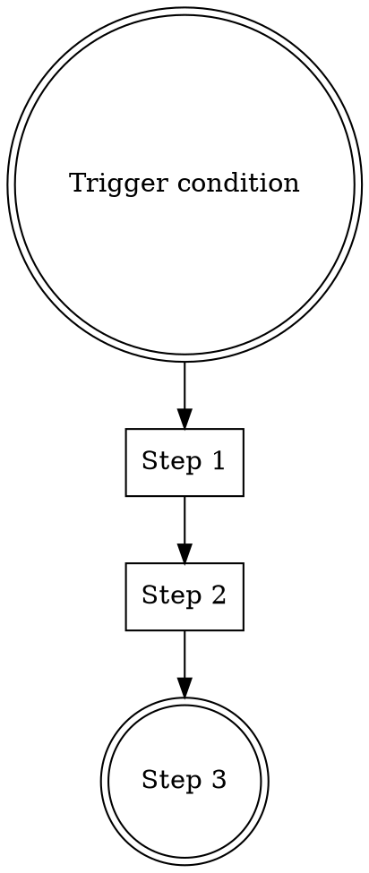

# {{Skill Title}}

## When to Use

[2-3 sentences describing the specific situations where this skill should be activated.]

## When NOT to Use

[1-2 sentences describing situations where this skill does not apply.]

## Process



### Step 1: [Name]

[What to do, with specific instructions.]

### Step 2: [Name]

[What to do, with specific instructions.]

## Common Scenarios

### Scenario A: [Typical use case]

[Specific example with concrete steps.]

### Scenario B: [Another use case]

[Specific example with concrete steps.]

## Anti-Patterns

| Thought | Reality |
|---------|---------|
| "[common rationalization]" | "[why it's wrong]" |
| "[common shortcut]" | "[what goes wrong]" |

## Key Principles

- **[Principle 1]**: [One sentence explanation]
- **[Principle 2]**: [One sentence explanation]
```