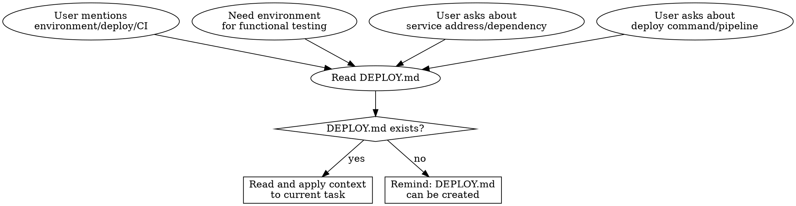

# Deploy Awareness

Read and maintain `DEPLOY.md` at project root as the standard source of deployment information.

## When to Read DEPLOY.md



**Read triggers:**
- User mentions test environment, staging, production, deployment
- Feature development complete, needs functional testing against real environment
- User asks about service addresses, database ports, Redis endpoints
- User asks about deploy commands, CI/CD pipelines, rollback procedures

**Not a read trigger:** Pure business logic questions ("fix typo in button")

## When to Remind About Updates

After editing or creating any file in the list below, check if DEPLOY.md exists at project root.

| Change Type | Files | Suggest Updating Section |
|-------------|-------|------------------------|
| Container/Orchestration | `docker-compose*.yml`, `Dockerfile*`, `k8s/**` | Environments, Dependencies |
| CI/CD | `.github/workflows/*`, `Jenkinsfile`, `.gitlab-ci.yml` | Deployment |
| Environment Variables | `.env*`, `.env.example`, `config/*` | Configuration |
| Gateway/Proxy | `nginx*.conf`, `*.proxy`, `caddy*` | Environments |
| Infrastructure | `terraform/**`, `ansible/**`, `Pulumi.*` | All sections |
| Service Dependencies | new database/cache/mq drivers in `package.json`, `requirements.txt`, `go.mod` | Dependencies |

**Behavior when DEPLOY.md exists:**
> "These changes affect [category]. Consider updating the [Section] in DEPLOY.md."
> Then assist with the update if user agrees.

**Behavior when DEPLOY.md does NOT exist:** Silent. Do not prompt creation.

**Do NOT trigger for:** Business logic files, UI components, API handlers, test files.

## Template

When user asks to create DEPLOY.md, use this structure:

```markdown
# DEPLOY.md

## Environments

| Name | URL | Purpose |
|------|-----|---------|
| dev | http://localhost:XXXX | local development |
| staging | https://staging.example.com | pre-release verification |
| prod | https://example.com | production |

## Deployment

- **Method**: [manual / CI/CD / GitOps]
- **Command/Pipeline**: [deploy command or pipeline name]
- **Rollback**: [rollback procedure]

## Dependencies

| Service | Address | Credentials |
|---------|---------|-------------|
| DB | host:port | See `.env` |

## Configuration

- **Environment Variables**: [`.env.example` or description]
- **Config Files**: [key config file paths]

## Monitoring

- **Logs**: [log URL or access method]
- **Alerts**: [alert config or owner]
```

**Template rules:**
- All sections optional — only include what the project uses
- Credentials fields contain pointers (e.g., "See `.env`"), never actual secrets
- Table format preferred for scanability

## Red Flags

| Thought | Reality |
|---------|---------|
| "User didn't ask about DEPLOY.md" | Deploy-related questions imply needing deployment context |
| "I'll just guess the staging URL" | Always read DEPLOY.md first |
| "This docker-compose change is minor" | Any infra change may need doc sync |
| "DEPLOY.md might be outdated" | Still read it — outdated info is better than none, and flag what looks stale |
| "User said 'test' not 'deploy'" | Functional testing often needs real environment info |
| "This is just a unit test, not functional testing" | Correct — unit tests don't need DEPLOY.md. Only trigger when testing against a real environment |
