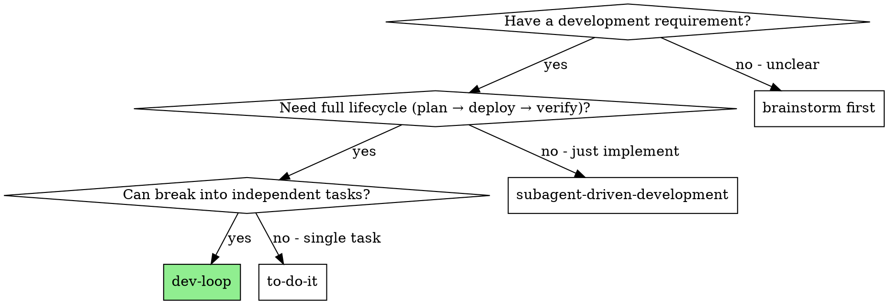

# dev-loop: Development Delivery Closed-Loop

Automate the full lifecycle of a development requirement: planning, TDD implementation, code review, deployment, E2E verification, and value proof — with loop-back on failure and escalation when stuck.

**Core principle:** A master agent orchestrates worker agents through a fixed pipeline. Master agent never writes code. It coordinates, reviews, and judges. Workers execute using SUMM skills.

**Why a loop:** Failures are normal in development. Rather than stopping on failure, this workflow diagnoses the failure type, returns to the appropriate phase, and retries. Human is involved only at escalation or post-hoc review.

## When to Use



**Use dev-loop when:**
- You have a clear development requirement (issue, user request, or spec)
- The requirement needs implementation + deployment + verification
- The work can be decomposed into tasks

**Don't use dev-loop when:**
- Quick fix or single change → use `summ:to-do-it`
- Only need implementation (no deploy/verify) → use `summ:subagent-driven-development`
- Requirement is unclear → use `summ:brainstorming` first

## Workflow State Machine

### Phases and Sub-states

```
Phase              Sub-state                  Actor
──────────────────────────────────────────────────────────────
PLANNING           BRAINSTORMING              Master Agent
                   PLAN_WRITING               Master Agent

BUILDING           TDD_IMPLEMENTING           Worker × N (Master dispatches)
                   CODE_REVIEWING             Master Agent

DELIVERING         DEPLOYING                  Worker (Master dispatches)
                   E2E_VERIFYING              Worker (Master dispatches)

VALIDATING         VALUE_PROVING              Master Agent
                   COMPLETING                 Master Agent
```

### Transition Rules

```
PLANNING.BRAINSTORMING
  → PLANNING.PLAN_WRITING     [brainstorming produces design]

PLANNING.PLAN_WRITING
  → BUILDING.TDD_IMPLEMENTING [plan with tasks produced]

BUILDING.TDD_IMPLEMENTING
  → BUILDING.CODE_REVIEWING   [all workers report DONE]
  → ESCALATED                 [worker BLOCKED, unresolvable]

BUILDING.CODE_REVIEWING
  → DELIVERING.DEPLOYING      [all PRs approved]
  → BUILDING.TDD_IMPLEMENTING [review issues → workers fix]

DELIVERING.DEPLOYING
  → DELIVERING.E2E_VERIFYING  [deploy successful, env ready]
  → BUILDING.TDD_IMPLEMENTING [deploy failed → code/config fix]

DELIVERING.E2E_VERIFYING
  → VALIDATING.VALUE_PROVING  [all E2E tests pass]
  → BUILDING.TDD_IMPLEMENTING [tests fail → bug fix]

VALIDATING.VALUE_PROVING
  → VALIDATING.COMPLETING     [requirement satisfied]
  → PLANNING.BRAINSTORMING    [requirement misunderstood]
  → BUILDING.TDD_IMPLEMENTING [partial implementation]

VALIDATING.COMPLETING
  → DONE                      [evidence archived, human notified]
```

### Loop-back Decision Table

| Failure source | Return to | Reason |
|----------------|-----------|--------|
| Code review issues | BUILDING.TDD | Code quality problems |
| Deploy failure | BUILDING.TDD | Code or config issue |
| E2E test failure | BUILDING.TDD | Bugs found |
| Value proof: wrong understanding | PLANNING | Requirement gap |
| Value proof: incomplete work | BUILDING.TDD | Missing features |
| Loop count ≥ 3 | ESCALATED | Force human intervention |

**Every loop-back increments loopCount.** Initial value is 1 (first pass). Each loop-back adds 1. When loopCount reaches maxLoops (default: 3), transition to ESCALATED regardless of failure type.

## Skills Used at Each Phase

| Phase | Skill | Who |
|-------|-------|-----|
| PLANNING.BRAINSTORMING | `summ:brainstorming` | Master |
| PLANNING.PLAN_WRITING | `summ:writing-plans` | Master |
| BUILDING.TDD_IMPLEMENTING | `summ:test-driven-development` | Worker |
| BUILDING.CODE_REVIEWING | `summ:requesting-code-review` | Master |
| DELIVERING.DEPLOYING | `summ:deploy` | Worker |
| DELIVERING.E2E_VERIFYING | Playwright / API tests | Worker |
| VALIDATING.VALUE_PROVING | Built into this skill | Master |

## Worker Dispatch

### How to Spawn a Worker

Use Agent-Orchestrator CLI to create isolated worker sessions:

```bash
ao spawn <project> \
  --prompt "<task prompt from worker-prompt-template.md>" \
  --system-prompt-file <path-to-worker-system-prompt>
```

**Worker prompt construction:**
1. Fill `./worker-prompt-template.md` with task-specific content
2. Set `SKILL_TO_LOAD` to the skill the worker must use
3. Paste full task text (never make worker read the plan file)
4. Set working directory to the project's worktree path

### Dispatch Strategy

Read the plan's task dependency graph:
- **Independent tasks**: Dispatch in parallel (one `ao spawn` per task)
- **Sequential tasks**: Dispatch one at a time, wait for DONE before next
- **Deploy/E2E**: Always single-worker, sequential (deploy first, then E2E)

### Monitoring Workers

After dispatching, poll worker status:

```bash
ao status <session-id>
```

**Activity states to handle:**
- `active` / `working` → Continue waiting
- `idle` / `ready` → Worker may have finished, check output
- `waiting_input` → Worker is asking a question, provide answer via `ao send`
- `blocked` / `exited` → Worker failed, assess and handle

**Polling cadence:** Check every 2-5 minutes. Do not poll continuously — use the time for other coordination work.

**Timeout:** If a worker exceeds 30 minutes without state change, treat as BLOCKED.

### Handling Worker Reports

Workers report one of four statuses:

**DONE:** Task completed successfully. Collect output, proceed to next task or code review.

**DONE_WITH_CONCERNS:** Completed but flagged doubts. Read concerns before proceeding. Address correctness/scope concerns. Note observations for later.

**NEEDS_CONTEXT:** Worker needs more information. Provide missing context and send via `ao send`.

**BLOCKED:** Worker cannot complete. Assess:
1. Context problem → provide more context, re-dispatch
2. Reasoning problem → re-dispatch with more capable model
3. Task too large → break into smaller pieces, re-dispatch
4. External blocker → ESCALATED

**Mixed results (some DONE, some BLOCKED):** When parallel workers return mixed statuses, do not block completed work on a single failure. Re-dispatch or escalate only the blocked task(s). Proceed with completed tasks through the pipeline. Value proof evaluates only the delivered scope.

## Code Review (BUILDING.CODE_REVIEWING)

After all workers report DONE:

1. Load `summ:requesting-code-review`
2. For each worker's PR:
   a. Read the diff: `gh pr diff <pr-url>`
   b. Compare against the task spec from the plan
   c. Check for: missing requirements, extra work, code quality
3. If issues found:
   - Document specific issues per PR
   - Transition back to BUILDING.TDD_IMPLEMENTING
   - Dispatch fix workers with specific review feedback
   - increment loopCount
4. If all PRs pass:
   - Transition to DELIVERING.DEPLOYING

**Never** skip code review. **Never** proceed with unfixed issues.

## Deployment (DELIVERING.DEPLOYING)

1. Dispatch one deploy worker:
   ```bash
   ao spawn <project> \
     --prompt "Deploy the application following DEPLOY.md" \
     --system-prompt-file <worker prompt with summ:deploy skill>
   ```
2. Worker reads DEPLOY.md, executes deployment steps
3. On success: record deploy URL/environment info as evidence, transition to E2E_VERIFYING
4. On failure: diagnose, transition back to BUILDING.TDD_IMPLEMENTING, increment loopCount

## E2E Verification (DELIVERING.E2E_VERIFYING)

1. The plan produced in PLANNING.PLAN_WRITING specifies which E2E strategy to use:
   - **Existing E2E tests**: Run against deployed environment
   - **New E2E tests**: Written during BUILDING phase, run now
   - **Manual API verification**: Worker makes real API calls
2. Dispatch one E2E worker:
   ```bash
   ao spawn <project> \
     --prompt "Run E2E verification: <strategy and commands from plan>" \
     --system-prompt-file <worker prompt (no SUMM skill for E2E — worker operates from instructions only)>"
   ```
   Note: E2E workers do not load a SUMM skill. They operate from the instructions in the prompt (test commands, target environment, expected results).
3. On success: collect test results as evidence, transition to VALUE_PROVING
4. On failure: collect failing test details, transition back to BUILDING.TDD_IMPLEMENTING, increment loopCount

## Value Proof (VALIDATING.VALUE_PROVING)

The master agent evaluates whether the delivery satisfies the original requirement.

**Evidence to collect:**
1. Original requirement text
2. Plan (what was intended)
3. Worker reports (what was implemented)
4. Code review results (quality gate passed)
5. Deploy status and URL
6. E2E test results

**Evaluation process:**
1. Re-read the original requirement
2. For each requirement point, check if evidence proves it's satisfied
3. Read the actual diff (`git diff <base>..<head>`) — do not trust reports alone
4. Check for scope creep (extra features not in requirement)

**Decision:**
- **PASS**: Every requirement point has evidence. No unrequested features. → COMPLETING
- **GAP (requirement misunderstood)**: What was built doesn't match what was asked. → PLANNING.BRAINSTORMING, loopCount++
- **GAP (partial implementation)**: Some requirement points have no evidence. → BUILDING.TDD_IMPLEMENTING, loopCount++

**Never** accept "close enough." Every point in the requirement must have corresponding evidence.

## Completing (VALIDATING.COMPLETING)

1. **Archive evidence**: Write a value proof document containing:
   - Requirement (original text)
   - Plan summary
   - Implementation summary (files changed, key decisions)
   - Test results
   - Deploy info
   - Value proof evaluation
2. **Notify human**: Send completion notification with:
   - Summary of what was delivered
   - Link to PR(s)
   - Link to deployed environment
   - Value proof document location

## Escalation

When transitioning to ESCALATED:
1. **Compile diagnostic report**:
   - Original requirement
   - Number of loops attempted
   - What failed at each loop
   - What was tried to fix it
   - Current state (partial work, blockers)
2. **Notify human** with the full diagnostic report
3. **Pause workflow** — do not continue until human responds

**Escalation triggers:**
- loopCount ≥ maxLoops (default: 3)
- Worker BLOCKED and unresolvable
- Master agent cannot determine failure type

## Red Flags

| Thought | Reality |
|---------|---------|
| "The deploy probably worked" | Verify with evidence, not assumptions |
| "Workers completed, that's enough" | Code review is mandatory, not optional |
| "E2E tests are nice to have" | E2E verification is a gate, not a suggestion |
| "Value proof is just a formality" | This is where wrong requirements get caught |
| "One more loop will fix it" | If loopCount is already 2, the problem may be deeper |
| "I'll just fix this myself" | Master agent never writes code. Dispatch a worker |
| "Skip review, the worker self-reviewed" | Self-review and code review serve different purposes |
| "Deploy failed, try again immediately" | Diagnose first — re-deploying the same code will fail again |

**Never:**
- Skip any phase or sub-state
- Proceed with unfixed issues
- Exceed maxLoops without escalating
- Write code as the master agent
- Deploy without passing code review
- Run E2E without successful deployment
- Accept value proof without reading the actual diff
