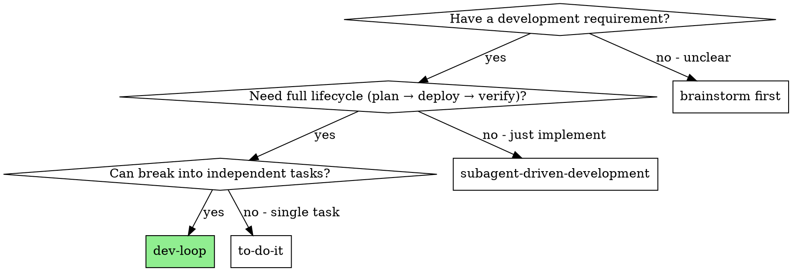

# dev-loop: Development Delivery Closed-Loop

Automate the full lifecycle of a development requirement: planning, TDD implementation, code review, deployment, E2E verification, and value proof — with loop-back on failure and escalation when stuck.

**Core principle:** A master agent orchestrates worker agents through a fixed pipeline. Master agent never writes code. It coordinates, reviews, and judges. Workers execute using SUMM skills.

**Why a loop:** Failures are normal in development. Rather than stopping on failure, this workflow diagnoses the failure type, returns to the appropriate phase, and retries. Human is involved only at escalation or post-hoc review.

## When to Use



**Use dev-loop when:**
- You have a clear development requirement (issue, user request, or spec)
- The requirement needs implementation + deployment + verification
- The work can be decomposed into tasks

**Don't use dev-loop when:**
- Quick fix or single change → use `summ:to-do-it`
- Only need implementation (no deploy/verify) → use `summ:subagent-driven-development`
- Requirement is unclear → use `summ:brainstorming` first

## Workflow State Machine

### Phases and Sub-states

```
Phase              Sub-state                  Actor
──────────────────────────────────────────────────────────────
PLANNING           BRAINSTORMING              Master Agent
                   PLAN_WRITING               Master Agent

BUILDING           TDD_IMPLEMENTING           Worker × N (Master dispatches)
                   CODE_REVIEWING             Master Agent

DELIVERING         DEPLOYING                  Worker (Master dispatches)
                   E2E_VERIFYING              Worker (Master dispatches)

VALIDATING         VALUE_PROVING              Master Agent
                   COMPLETING                 Master Agent
```

### Transition Rules

```
PLANNING.BRAINSTORMING
  → PLANNING.PLAN_WRITING     [brainstorming produces design]

PLANNING.PLAN_WRITING
  → BUILDING.TDD_IMPLEMENTING [plan with tasks produced]

BUILDING.TDD_IMPLEMENTING
  → BUILDING.CODE_REVIEWING   [all workers report DONE]
  → ESCALATED                 [worker BLOCKED, unresolvable]

BUILDING.CODE_REVIEWING
  → DELIVERING.DEPLOYING      [all PRs approved]
  → BUILDING.TDD_IMPLEMENTING [review issues → workers fix]

DELIVERING.DEPLOYING
  → DELIVERING.E2E_VERIFYING  [deploy successful, env ready]
  → BUILDING.TDD_IMPLEMENTING [deploy failed → code/config fix]

DELIVERING.E2E_VERIFYING
  → VALIDATING.VALUE_PROVING  [all E2E tests pass]
  → BUILDING.TDD_IMPLEMENTING [tests fail → bug fix]

VALIDATING.VALUE_PROVING
  → VALIDATING.COMPLETING     [requirement satisfied]
  → PLANNING.BRAINSTORMING    [requirement misunderstood]
  → BUILDING.TDD_IMPLEMENTING [partial implementation]

VALIDATING.COMPLETING
  → DONE                      [evidence archived, human notified]
```

### Loop-back Decision Table

| Failure source | Return to | Reason |
|----------------|-----------|--------|
| Code review issues | BUILDING.TDD | Code quality problems |
| Deploy failure | BUILDING.TDD | Code or config issue |
| E2E test failure | BUILDING.TDD | Bugs found |
| Value proof: wrong understanding | PLANNING | Requirement gap |
| Value proof: incomplete work | BUILDING.TDD | Missing features |
| Loop count ≥ 3 | ESCALATED | Force human intervention |

**Every loop-back increments loopCount.** When loopCount reaches maxLoops (default: 3), transition to ESCALATED regardless of failure type.

## Skills Used at Each Phase

| Phase | Skill | Who |
|-------|-------|-----|
| PLANNING.BRAINSTORMING | `summ:brainstorming` | Master |
| PLANNING.PLAN_WRITING | `summ:writing-plans` | Master |
| BUILDING.TDD_IMPLEMENTING | `summ:test-driven-development` | Worker |
| BUILDING.CODE_REVIEWING | `summ:requesting-code-review` | Master |
| DELIVERING.DEPLOYING | `summ:deploy` | Worker |
| DELIVERING.E2E_VERIFYING | Playwright / API tests | Worker |
| VALIDATING.VALUE_PROVING | Built into this skill | Master |
