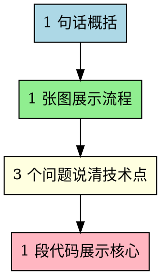

# Less - 认知友好的方案审阅格式

将复杂方案压缩为最小审阅单元，避免认知过载。

**核心原则：** 用户第一次审阅时不应该看到超过一屏的内容。

## When to Use

**Use when:**
- 需要用户确认方案/设计/计划
- 准备展示复杂的技术文档
- 用户需要做决策前

**NOT for:**
- 代码实现细节
- 已经批准的方案执行阶段

## The 1-1-3-1 Format



### 1 句话概括

一句话说明方案的核心目标。

```
本方案通过 [方法] 解决 [问题]，实现 [价值]。
```

### 1 张图展示流程

用 Mermaid/Graphviz 展示关键流程或架构。

```dot
// 示例：用户认证流程
用户请求 -> API网关 -> 认证服务 -> 数据库
```

**原则：** 节点不超过 6 个，层级不超过 3 层。

### 3 个问题说清技术点

用问答形式解释关键技术决策：

1. **为什么选择 X 而不是 Y？**
   > 简短回答（1-2句）

2. **最大的风险是什么？**
   > 简短回答（1-2句）

3. **如何验证方案有效？**
   > 简短回答（1-2句）

### 1 段代码展示核心

展示最核心的代码片段（不超过 20 行）：

```typescript
// 只展示核心逻辑，省略边界情况和错误处理
const coreFunction = (input) => {
  // 核心转换
  return transform(input);
};
```

## 完整示例

> **1 句话概括**
> 本方案通过 Redis 缓存层解决数据库查询瓶颈，将 API 响应时间从 2s 降至 100ms。
>
> **1 张图展示流程**
> ```dot
> Client -> API -> Cache? -> Redis | DB
> ```
>
> **3 个问题**
> 1. 为什么用 Redis 而不是本地缓存？ → 多实例共享，支持过期策略
> 2. 缓存失效怎么办？ → 写时失效 + TTL 双保险
> 3. 如何验证效果？ → 对比缓存前后的 P99 延迟
>
> **1 段代码**
> ```typescript
> async function getWithCache(key: string) {
>   const cached = await redis.get(key);
>   if (cached) return JSON.parse(cached);
>   const data = await db.query(key);
>   await redis.setex(key, 300, JSON.stringify(data));
>   return data;
> }
> ```

## Process

1. **识别要审阅的方案** - 找出需要用户确认的文档或计划
2. **提取核心** - 找出方案的本质目标
3. **按 1-1-3-1 格式压缩** - 严格限制每部分大小
4. **展示给用户** - 获得快速反馈
5. **按需展开** - 用户确认后再提供详细文档

## Common Mistakes

| Mistake | Fix |
|---------|-----|
| 概括超过 2 句 | 删减到 1 句，保留最核心的价值 |
| 流程图太复杂 | 只保留主路径，分支用文字说明 |
| 问题超过 3 个 | 选最关键的 3 个，其余放到详细文档 |
| 代码超过 20 行 | 只展示核心函数，省略辅助逻辑 |
| 省略关键信息 | 1-1-3-1 是入口，不是全部；审阅通过后展开细节 |

## Key Principles

- **Less is more** - 审阅的目的是快速决策，不是完整理解
- **渐进展开** - 先确认方向，再深入细节
- **尊重认知限制** - 用户没有时间阅读长文档
- **用中文** - 与用户沟通用中文
