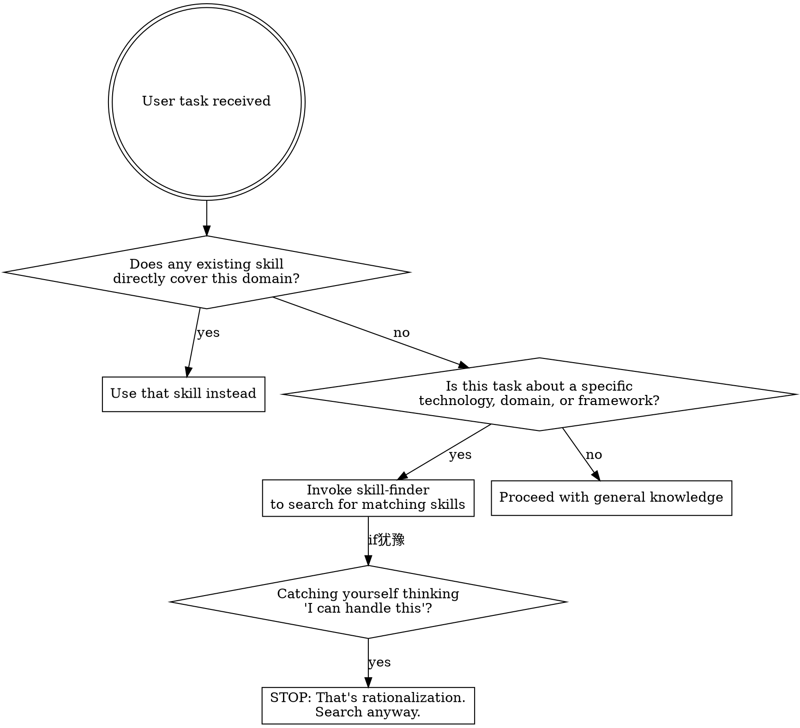

# Skill Finder (技能查找器)

## Overview

从 antigravity-awesome-skills 仓库搜索并加载专业技能。当遇到复杂或需要专业知识的工作，且当前没有对应的 skill 时，使用此技能查找并加载外部技能。

**核心功能**：
- 更新 antigravity-awesome-skills 仓库（git pull）
- 基于描述搜索匹配的技能
- 将选中的技能加载到 `skills/ext-<id>/` 目录
- 支持 Skill 工具通过 `summ:ext-<id>` 调用已加载的技能

## When to Use



**适用场景**：
- 任务涉及特定技术栈（Kubernetes, Terraform, PostgreSQL, Redis, etc.）
- 需要领域专业知识（安全审计、性能优化、数据处理等）
- 当前 SUMM-Powers 技能库没有覆盖的任务
- 用户明确要求查找特定类型的技能
- 你不确定某个领域的最佳实践

**不适用场景**：
- 已有技能直接覆盖的任务
- 纯粹的代码逻辑修改（不涉及特定技术领域）

### Red Flags — 当你有这些想法时，立刻触发 skill-finder

| 想法 | 现实 |
|------|------|
| "我用通用知识就能处理" | 通用知识遗漏领域特定的最佳实践和陷阱 |
| "这些都是标准模式" | 标准模式也有领域专用的优化和注意事项 |
| "找到的可能性很低" | 不搜索就不知道，搜索成本极低 |
| "在我能力范围内" | 能力和最佳实践是两回事 |
| "这个太简单了不需要" | 简单任务也可能有领域专用的工具和流程 |

## Configuration

### 路径配置（按优先级）

1. **环境变量**（最高优先级）：
   ```bash
   export ANTIGRAVITY_SKILLS_PATH=/path/to/antigravity-awesome-skills
   ```

2. **常见路径自动检测**：
   - `$HOME/github/antigravity-awesome-skills`
   - `$HOME/projects/antigravity-awesome-skills`
   - `$HOME/.claude/antigravity-awesome-skills`

3. **自动克隆**（如果以上都没有）：
   ```bash
   git clone https://github.com/sickn33/antigravity-awesome-skills ~/.claude/antigravity-awesome-skills
   ```

### 获取路径的方法

```bash
# 优先使用环境变量
SKILLS_PATH="${ANTIGRAVITY_SKILLS_PATH:-}"

# 如果没有设置，尝试常见路径
if [ -z "$SKILLS_PATH" ]; then
  for path in "$HOME/github/antigravity-awesome-skills" "$HOME/projects/antigravity-awesome-skills" "$HOME/.claude/antigravity-awesome-skills"; do
    if [ -d "$path" ]; then
      SKILLS_PATH="$path"
      break
    fi
  done
fi

# 如果还是没有，自动克隆
if [ -z "$SKILLS_PATH" ]; then
  git clone https://github.com/sickn33/antigravity-awesome-skills "$HOME/.claude/antigravity-awesome-skills"
  SKILLS_PATH="$HOME/.claude/antigravity-awesome-skills"
fi

echo "Using skills path: $SKILLS_PATH"
```

## The Process

### 1. Setup / Update Repository

首先检测并更新 antigravity-awesome-skills 仓库：

```bash
# 检测路径（按上述配置逻辑）
# 假设检测到路径为 $SKILLS_PATH

cd "$SKILLS_PATH" && git pull origin main
```

### 2. Search Skills Index

读取 `skills_index.json` 并基于用户描述搜索匹配的技能。搜索维度包括：
- `name` - 技能名称
- `description` - 技能描述
- `category` - 分类
- `tags` - 标签

搜索策略：
1. 精确匹配关键词
2. 模糊匹配描述内容
3. 按相关度排序结果

### 3. Present Results

展示匹配结果供用户选择：

```
找到 X 个匹配的技能：

[#] name - description
    Category: xxx | Risk: xxx | Source: xxx

[#] name - description
    Category: xxx | Risk: xxx | Source: xxx
...
```

**风险提示**：展示技能的 `risk` 级别（safe/unknown/critical），提醒用户注意安全。

### 4. Load Selected Skill

用户选择后，将技能复制到 `skills/ext-<skill-id>/` 目录：

```bash
# 源路径（使用检测到的 SKILLS_PATH）
SOURCE="$SKILLS_PATH/skills/<skill-id>/"

# 目标路径（相对于当前 SUMM-Powers 插件目录）
# 可通过环境变量 SUMM_POWERS_PATH 配置，默认为插件安装位置
TARGET="${SUMM_POWERS_PATH:-.}/skills/ext-<skill-id>/"

# 复制命令
cp -r "$SOURCE" "$TARGET"
```

### 5. Usage Instructions

加载完成后，告知用户如何使用：

```
技能已加载: ext-<skill-id>

调用方式：
- Skill 工具: summ:ext-<skill-id>
- 斜杠命令: /summ:ext-<skill-id>（如果已配置）

技能路径: skills/ext-<skill-id>/SKILL.md
```

## External Skills Directory

外部技能存放在 `skills/` 目录下，以 `ext-` 前缀命名：

```
skills/
├── ext-007/
│   └── SKILL.md
├── ext-security-audit/
│   └── SKILL.md
└── ...
```

**命名约定**：使用 `ext-<原始id>` 作为目录名，确保 Claude Code 能发现并调用。

## Integration

**调用已加载的外部技能**：

```
summ:ext-<skill-id>
```

例如：加载了 `007` 技能后，使用 `summ:ext-007` 调用。

## Example Usage

**用户输入**：
```
/summ:find-skill security audit penetration testing
```

**执行流程**：
1. 检测/克隆 antigravity-awesome-skills 仓库
2. git pull 更新仓库
3. 搜索 skills_index.json
4. 找到匹配：007, security-audit, pentest-guide...
5. 展示结果，用户选择 #1 (007)
6. 复制到 skills/ext-007/
7. 提示：使用 `summ:ext-007` 调用

## Key Principles

- **可移植性**：不硬编码路径，支持环境变量配置
- **安全优先**：展示技能风险级别，提醒用户审慎使用 critical 级别技能
- **保留技能**：加载的技能保留在 skills/ext-<id>/ 供后续使用
- **用中文沟通**：与用户交互使用中文
- **按需加载**：只在需要时才加载外部技能，避免膨胀

## Troubleshooting

| 问题 | 解决方案 |
|------|----------|
| 找不到仓库 | 设置 `ANTIGRAVITY_SKILLS_PATH` 环境变量，或允许自动克隆 |
| git pull 失败 | 检查网络连接，或手动更新仓库 |
| 找不到匹配技能 | 尝试更通用的关键词，或查看 CATALOG.md |
| 技能加载失败 | 检查源技能目录结构是否完整 |
| 调用技能失败 | 确认技能已正确复制到 skills/ext-<id>/ 且目录名不含冒号 |
| 路径权限问题 | 确保有读写权限，或更换目标目录 |

## Environment Variables

| 变量 | 说明 | 默认值 |
|------|------|--------|
| `ANTIGRAVITY_SKILLS_PATH` | antigravity-awesome-skills 仓库路径 | 自动检测或 `~/.claude/antigravity-awesome-skills` |
| `SUMM_POWERS_PATH` | SUMM-Powers 插件安装路径 | 插件缓存目录 |
