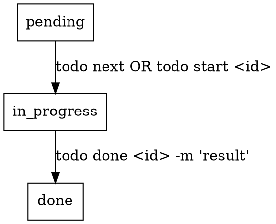

# SUMM-Todo Integration

## Overview

Track plan writing and execution progress with SUMM-Todo CLI tasks. Designed as a sub-skill for summ:writing-plans and summ:executing-plans.

**IRON LAW: Every task MUST have a project.**

## Get Default Project Name

```bash
PROJECT=$(git remote get-url origin 2>/dev/null | sed -n 's#.*/\([^/]*\)\.git#\1#p' || \
  basename "$(git rev-parse --show-toplevel 2>/dev/null)" || \
  echo "summ-plans")
```

Fallback chain: git remote URL → git directory name → `summ-plans`

## Ensure Project Exists

**Before adding tasks, ensure the project exists:**

```bash
# Check if project exists, create if not
todo project show "$PROJECT" 2>/dev/null || todo project add "$PROJECT" -d "Project tasks"
```

## Quick Reference

| Operation | Command |
|-----------|---------|
| Create project | `todo project add <name> [-d "description"]` |
| List projects | `todo project list` |
| Create task with project | `todo add "<project>: <title>" --pri medium --tag <tag>` |
| Start plan task | `todo next --tag plan` or `todo start <id>` |
| Complete plan task | `todo done <id> -m "Plan saved to docs/plans/<filename>.md"` |
| Create execution task | `todo add "<project>: <title>" --pri medium --tag execute` |
| Start execution task | `todo next --tag execute` or `todo start <id>` |
| Complete execution task | `todo done <id> -m "Task completed with result"` |

## Task Lifecycle



## Task States

SUMM-Todo enforces state transitions:

```
pending → in_progress → done
    ↓         ↓
cancelled  blocked
             ↓
          in_progress (resume)
```

**Valid transitions:**
- `pending` → `in_progress` (via `todo next` or `todo start`)
- `in_progress` → `done` (via `todo done`)
- `in_progress` → `blocked` (via `todo block`)
- `blocked` → `in_progress` (via `todo resume`)

**Terminal states:** `done`, `cancelled` (no further changes allowed)

## Tag Convention

- `plan` - Plan writing tasks
- `execute` - Plan execution tasks
- `plan:<filename>` - Plan identifier (e.g., `plan:2026-02-04-feature`)
- `todo` - General todo tasks

## Command Details

### Create Task (with Project)
```bash
# Syntax: "ProjectName: task title"
todo add "SUMM-Powers: Implement feature X" \
  --pri high|medium|low \
  --tag <tag>
```

**Project prefix is REQUIRED.** If no project specified, use default project name from git repo.

### Task Title Guidelines

**标题必须有辨识度** - 能一眼看出任务涉及什么模块/功能/问题。

**好标题:** 包含具体上下文（模块名、文件名、功能名、问题类型）
```
✓ "summ-todo技能: 添加任务标题辨识度要求"
✓ "commands/todo.md: 修复无限循环bug"
✓ "frontend-design: 添加暗色主题支持"
✓ "API /users/: 删除未使用的字段"
```

**坏标题:** 模糊、通用、无法区分
```
✗ "修复bug"
✗ "添加功能"
✗ "更新文档"
✗ "优化代码"
```

### Claim Next Task
```bash
# Claim next pending task (auto-assigns to agent)
todo next

# Claim by tag filter
todo next --tag backend
todo next --tag execute --pri high
```

### Complete Task
```bash
# Result is REQUIRED
todo done <id> -m "What was accomplished"

# With artifacts
todo done <id> \
  -m "Feature implemented" \
  --artifact "commit:abc123" \
  --artifact "pr:45"
```

### Block/Resume
```bash
# Block when waiting on external input
todo block <id> --reason="Waiting for clarification"

# Resume when unblocked
todo resume <id>
```

## Keep It Simple

- No parent/child task relationships
- No task dependencies
- Each task is independent
- One task = one Task from the plan
- Results required when completing tasks

## Output Format

SUMM-Todo uses **TOON format** by default - token-efficient for LLMs:

```toon
id: "5f9570e3"
title: "Replace TaskWarrior with SUMM-Todo"
project_id: "c38a2f77"
creator: human
priority: high
tags[1]: integration
status: in_progress
```

Use `todo --json list` for JSON output if needed for scripts.

## Common Mistakes

| Mistake | Fix |
|---------|-----|
| Forgetting project prefix | Always use `"ProjectName: task title"` format |
| Project doesn't exist | Create project first: `todo project add <name>` |
| Using project flag | No `--project` flag exists; use prefix syntax only |

## Integration

**Used by:**
- **summ:writing-plans** - Track plan writing (create task → start → done)
- **summ:executing-plans** - Track task execution (create per-task → start each → done each)
- **summ:to-do-it** - Track small task execution (create → start → done)
