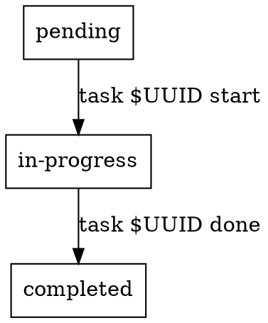

# TaskWarrior Integration

## Overview

Track plan writing and execution progress with TaskWarrior tasks. Designed as a sub-skill for summ:writing-plans and summ:executing-plans.

## Get Project Name

```bash
PROJECT=$(git remote get-url origin 2>/dev/null | sed -n 's#.*/\([^/]*\)\.git#\1#p' || \
  basename "$(git rev-parse --show-toplevel 2>/dev/null)" || \
  echo "summ-plans")
```

Fallback chain: git remote URL → git directory name → `summ-plans`

## Quick Reference

| Operation | Command |
|-----------|---------|
| Create plan task | `task add project:$PROJECT +plan +plan:$PLAN_FILE "$DESCRIPTION"` |
| Start plan task | `task $UUID start` |
| Complete plan task | `task $UUID done` |
| Create execution task | `task add project:$PROJECT +execute +plan:$PLAN_FILE "$DESCRIPTION"` |
| Start execution task | `task $UUID start` |
| Complete execution task | `task $UUID done` |

## Task Lifecycle



## Tag Convention

- `+plan` - Plan writing tasks
- `+execute` - Plan execution tasks
- `+plan:<filename>` - Plan identifier (e.g., `+plan:2026-02-04-feature`)

## Keep It Simple

- No parent/child task relationships
- No task dependencies
- Each task is independent
- One task = one Task from the plan

## Integration

**Used by:**
- **summ:writing-plans** - Track plan writing (create task → start → done)
- **summ:executing-plans** - Track task execution (create per-task → start each → done each)
