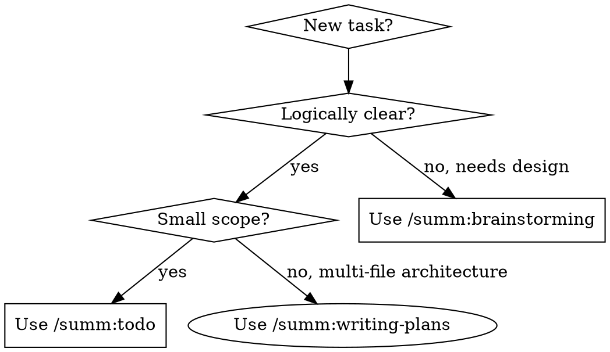

# Quick Todo Execution

## Overview

Execute small, clear tasks directly: analyze → confirm → execute → verify. Skip brainstorming and planning documentation.

**Core principle:** Fast execution for logically straightforward tasks without overhead.

**Announce at start:** "I'm using the todo skill to quickly complete this task."

**OPTIONAL SUB-SKILL:** Use summ:taskwarrior for global tracking

## When to Use



**Use for:**
- Simple fixes (typos, renames, small logic changes)
- Small features (add loading state, simple validation)
- Setup tasks (install dependencies, configure tools)
- Clear bug fixes (known issue, known solution)
- Environment configuration

**NOT for:**
- New features requiring architecture decisions
- Multi-system changes affecting many files
- Tasks where the approach is unclear
- "Design a new system" type requests

## The Process

### Step 1: Analyze

1. Read relevant files as needed (no limit)
2. Ask questions until you understand the task (no limit, but recognize when task needs brainstorming)
3. Assess complexity: simple / medium / complex

### Step 2: Confirm

Present to user:

```
I understand you want to: [one-line summary]

Plan:
1. [step 1]
2. [step 2]
...

Complexity: simple/medium/complex
```

- **Simple/medium:** "Does this look right? Should I proceed?"
- **Complex:** "This task is somewhat complex. Do you want to proceed directly or use /summ:writing-plans for a structured approach?"

On confirmation:
1. Create TodoWrite for step tracking
2. **Invoke Skill tool with `summ:taskwarrior` to create a tracking task**

### Step 2.5: Create TaskWarrior Task

Use the Skill tool to invoke `summ:taskwarrior` and create a global tracking task:
- Description: brief summary of the todo task
- Project: auto-detected from git repo
- Tags: +todo

This ensures the task is tracked globally even if the conversation is interrupted.

### Step 3: Execute

For each todo:
1. Mark in_progress
2. Execute the step
3. Mark completed

### Step 4: Verify and Complete

1. Run verification based on task type:
   - Code changes: tests, build, or lint
   - Setup: verify installation works
   - Configuration: verify config is applied
2. Summarize what was changed
3. **Invoke Skill tool with `summ:taskwarrior` to mark the tracking task done**
4. Clear TodoWrite list

## TaskWarrior Integration

Create one task for the entire todo session:

```bash
# Get project identifier
PROJECT=$(git remote get-url origin 2>/dev/null | sed -n 's#.*/\([^/]*\)\.git#\1#p' || \
  basename "$(git rev-parse --show-toplevel 2>/dev/null)" || \
  echo "summ-todo")

# Create task
TASK_UUID=$(task add project:$PROJECT +todo "[brief description]")

# ... execute todos ...

# Complete when done
task $TASK_UUID done
```

**Keep it simple:** One TaskWarrior task per todo skill invocation.

## When to Stop and Suggest Upgrading

**Stop and suggest brainstorming/writing-plans when:**
- Task involves multiple system interactions
- User keeps adding new requirements (scope creep)
- Unexpected architectural issues discovered
- You can't understand the task after reasonable questioning

**Say:** "This task is getting complex. Would you like to pause and use /summ:writing-plans for a structured approach?"

## Common Mistakes

| Mistake | Fix |
|---------|-----|
| Creating design docs | Don't. This skill skips docs intentionally |
| Over-analyzing simple tasks | Read what's needed, then confirm and execute |
| Creating plan files | Don't. That's what writing-plans is for |
| Skipping verification | Always verify before completing |
| Too many questions | If you can't understand after reasonable questions, suggest brainstorming |
| One TaskWarrior task per step | No, one task for the entire todo session |

## Integration with Other Skills

**Optional sub-skills:**
- `summ:taskwarrior` - Global task tracking
- `summ:systematic-debugging` - When problems arise during execution
- `summ:verification-before-completion` - Final verification

**Not compatible with:**
- `summ:writing-plans` - This skill replaces it for small tasks
- `summ:brainstorming` - This skill is for when design is already clear

## Remember

- Ask questions until you understand, then confirm and execute
- Read as many files as needed
- Create one TaskWarrior task per todo skill invocation
- Don't create design docs or plan files
- Verify work before completing
- Suggest upgrading to writing-plans when task gets complex
