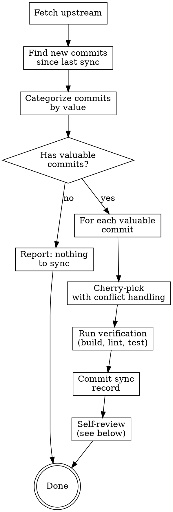

# Upstream Sync (上游同步)

从 obra/superpowers 同步有价值的修改到 SUMM-Powers fork。

**核心原则**: Cherry-pick，不 merge。每次同步都是独立审查和选择性应用。

## When to Use

- 用户说 "sync upstream"、"同步上游"、"cherry-pick upstream"
- 定期检查上游更新
- 需要了解上游和本 fork 的差异

## Sync Workflow



### Step 1: Fetch and Identify

```bash
# 1. Fetch upstream
git fetch upstream main

# 2. Find last sync point from docs/upstream-sync-records.md
# Look for the most recent "Sync Point" entry

# 3. List new commits since last sync
git log --oneline <last-sync-sha>..upstream/main
```

### Step 2: Categorize Commits

For each commit, classify into one of these categories:

| Category | Action | Examples |
|----------|--------|---------|
| **bugfix** | Cherry-pick | Portable shebangs, platform fixes, crash fixes |
| **feature** | Evaluate case-by-case | New skill, new workflow, improved UX |
| **refactor** | Usually skip | Code reorganization, variable renames |
| **codex/opencode** | Skip | Codex/OpenCode specific changes |
| **formatting** | Skip | Whitespace, formatting-only changes |
| **docs** | Evaluate | README updates, new documentation |
| **infra** | Evaluate | CI changes, build tooling |
| **tests** | Usually cherry-pick | New tests for existing functionality |

**Exclusion rules** (auto-skip these):
- Commits touching only `codex/`, `opencode/`, `agents/openai.yaml` — Codex/OpenCode specific
- Commits touching only `scripts/sync-to-codex-plugin.sh` — Codex sync tooling
- Pure formatting commits (check with `git diff --stat`, only whitespace/line-break changes)
- README-only commits that are Codex/OpenCode related (check commit message for "codex", "opencode", "plugin")
- Commits that conflict with SUMM-specific features (skills in `skills/` that only exist in SUMM-Powers)

**Batch processing** (when 50+ commits to analyze):
1. First group by file path — commits touching same excluded paths can be bulk-skipped
2. Then batch-categorize remaining by commit message patterns (bugfix/feature/refactor)
3. Only deep-analyze commits in "evaluate" categories

### Step 3: Cherry-pick with Conflict Handling

For each valuable commit:

```bash
# Attempt cherry-pick
git cherry-pick <sha>

# If conflict:
# 1. Analyze the conflict
# 2. Resolve manually, preferring our version for SUMM-specific files
# 3. git add <resolved-files>
# 4. git cherry-pick --continue
```

**Conflict resolution priority**:
1. **SUMM-specific files** (skills/summ-*, docs/superpowers/*): Keep our version
2. **Shared files with SUMM modifications**: Carefully merge, preserving both changes
3. **Upstream-only files**: Accept upstream version
4. **Test files**: Accept upstream if tests are for unchanged functionality

### Step 4: Verify

After all cherry-picks:
1. Check for stale conflict markers: `grep -r "<<<<<<" skills/ hooks/ scripts/`
2. Verify skill frontmatter is valid across all SKILL.md files
3. Check that no SUMM-specific references were lost

### Step 5: Record and Commit

Record the sync in `docs/upstream-sync-records.md` following the template, then commit all changes.

## Self-Review Process (自我审视)

After each sync, answer these questions and append to the sync record:

### Review Checklist

1. **What was synced?** — List the commits cherry-picked and why
2. **What was skipped?** — List commits skipped and why
3. **Conflicts encountered** — Document each conflict and how it was resolved
4. **Time spent** — How long did this sync take?
5. **What went well?** — What parts of the process worked smoothly?
6. **What could improve?** — Identify friction points or mistakes
7. **Strategy adjustments** — Based on this sync, what should change in the approach?

### Self-Improvement Loop

After completing the review, check if any of these improvements apply:

| Observation | Improvement Action |
|-------------|-------------------|
| Recurring conflict in same files | Add to exclusion rules or note conflict pattern |
| Spent too long categorizing | Refine categorization criteria with examples |
| Missed an important commit | Add pattern to categorization rules |
| Skipped something that turned out important | Update category priority |
| Conflict resolution was unclear | Add specific resolution guidance |

**If improvements are found, update this SKILL.md file** with the refined rules before finishing.

## Dry-Run Mode

If the user wants to preview without making changes:

```bash
# Just list and categorize, don't cherry-pick
# Report findings to user for approval
```

Set `DRY_RUN=true` in your approach: fetch, categorize, and present findings without modifying any files. Wait for user approval before executing.

## Sync Record Template

Each sync entry in `docs/upstream-sync-records.md` follows this format:

```markdown
## YYYY-MM-DD Sync

- **Upstream range**: `<start-sha>..<end-sha>`
- **Commits analyzed**: N
- **Cherry-picked**: N commits
- **Skipped**: N commits
- **Conflicts**: N

### Cherry-picked
| SHA | Message | Category | Notes |
|-----|---------|----------|-------|
| abc1234 | Fix X | bugfix | Clean apply |

### Skipped
| SHA | Message | Category | Reason |
|-----|---------|----------|--------|
| def5678 | Add Codex Y | codex | Codex-specific |

### Self-Review
- **What went well**: ...
- **What could improve**: ...
- **Strategy adjustments**: ...
```

## Quick Reference

```bash
# Check for new upstream commits
git fetch upstream main
git log --oneline <last-sync>..upstream/main

# Count new commits
git rev-list <last-sync>..upstream/main --count

# See diff summary
git diff --stat <last-sync>..upstream/main

# Cherry-pick a specific commit
git cherry-pick <sha>

# Abort a failed cherry-pick
git cherry-pick --abort
```
